# LLM & Agent：从“文字接龙”到能做事的软件系统

> 面向后端、前端、测试及其他研发岗位  
> 内容基线：2026 年 8 月
> 学习路径：What（是什么）→ Why（为什么）→ How（怎样用）
>
> 简介：从 LLM 的能力边界出发，对比 Chat Completions、Anthropic Messages 与 Responses，拆解上下文工程、MCP、Skills、Memory 和 Sub-agent，并用 PHP 从零实现可交互 Agent。

## 分享全局思维导图

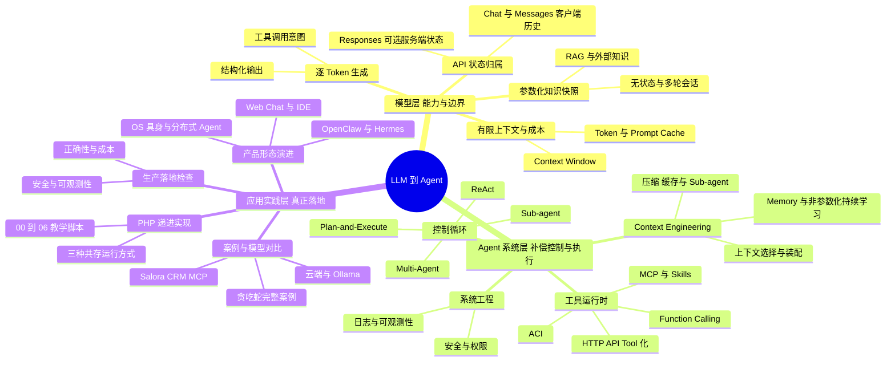

> 阅读建议：按“模型层 → Agent 系统层 → 应用与实践层”阅读：先明确模型的能力边界，再理解 Agent 怎样补偿、控制和执行，最后通过 PHP 递进代码和贪吃蛇案例观察系统怎样落地。

## 0. 分享目标

听完后，参与者应能回答：

1. LLM 到底做了什么，哪些能力属于模型，哪些属于外围软件；
2. Chat Completions、Anthropic Messages 与 Responses 在消息结构和状态管理上有什么区别；
3. 为什么会出现 Prompt、RAG、Context Engineering、Memory、Function Calling、MCP 和 Skills；
4. Agent 如何把模型输出变成真实动作，又如何通过 MCP 安全调用既有 HTTP API；
5. 如何读懂一次 Agent 的请求、响应、Sub-agent 委派、工具调用和上下文压缩；
6. 如何用普通 PHP 实现一个具备现代核心部件的 Agent。

本分享使用两个便于理解但必须加限定的心智模型：

- **LLM 是训练数据在参数中的“有损、统计性快照”**：它不是可逐条查询、可证明完整性的知识库，也可能生成训练截止之后的知识。
- **自回归 LLM 在推理时逐 Token 预测后续内容**：它不只是按字面复制常见句子；训练、上下文学习和推理策略使这种预测表现出问答、规划、代码生成等复杂能力。

这两个比喻用于祛魅，不用于否定能力。

---

## 1. 一张总图：模型和 Agent 各自负责什么

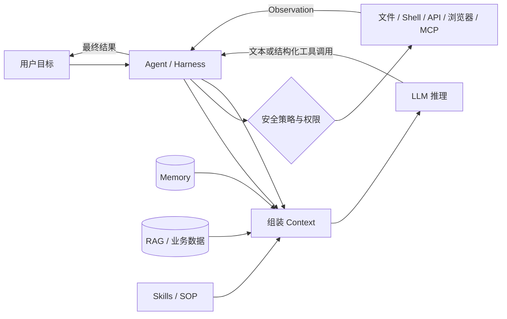

工程上可以把当前 LLM Agent 粗略理解为：

> **Agent = LLM + 上下文装配 + 工具运行时 + 状态/记忆 + 控制循环 + 安全边界 + 可观测性。**

LLM 给出“下一步应该做什么”的 Token；Agent runtime 才真正读文件、发 HTTP 请求、调用数据库或操作浏览器。模型是决策组件，不是凭空影响现实世界的黑魔法。

---

## 2. What：LLM 是什么

### 2.1 训练与推理不是一回事

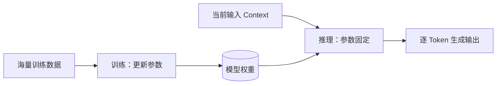

- **预训练/微调**改变参数，成本高、周期长，形成参数化知识和行为倾向；
- **推理**通常不改参数，只基于固定权重和本次 Context 生成；
- RAG、Memory、Skills 通常是在推理时补充输入，不等于模型重新训练；
- 某些在线学习系统会在任务间更新外部记忆、Prompt 或模型参数，要具体区分。

### 2.2 “知识快照”的准确版本

这个说法解释了三件事：

1. 参数化知识有训练时间边界，最新事实可能不存在或已过时；
2. 权重不会因普通对话自动永久改变；
3. 企业私有数据默认不在模型参数中。

但它也容易误导：

- 权重不是数据库行记录，无法保证事实完整、精确和可追溯；
- 训练是压缩和泛化，不是把网页原样存进去；
- 模型可能通过当前 Context、联网检索或工具获得“快照之后”的信息；
- “知道”不等于每次都能稳定召回，提示方式、上下文位置和干扰都会影响结果。

所以更准确的说法是：**LLM 是由训练形成的参数化统计模型；它携带有损的参数化知识，但回答还由当前 Context 共同决定。**

### 2.3 “文字接龙”的准确版本

自回归生成可写成：


> LaTeX 源码：`P(x_{1:n})=\prod_{t=1}^{n}P(x_t \mid x_{<t}, C)`。其中 `C` 表示本次推理额外提供的上下文。

模型每一步根据已有 Token 和 Context，计算下一个 Token 的概率分布，再按解码策略选取输出。`temperature` 调整分布的随机性，但不是“聪明程度”旋钮。

“只是文字接龙”强调了正确的一面：最终接口仍是 Token 输入和 Token 输出。它忽略的一面是：为了做好下一个 Token 预测，模型学习了语言、代码、事实关联和部分可泛化的问题求解模式。复杂行为与逐 Token 生成并不矛盾。

### 2.4 Token、算力和成本

- Token 是模型处理文本的离散单位，不等于字符或单词；
- 输入需要经过前向计算并占用 KV cache，输出 Token 又要逐个解码；
- API 按 Token 计价主要是在为训练摊销、推理算力、显存、调度和服务能力付费，不是为网络流量付费；
- 本地部署不会让成本消失，只会把 API 账单转化为 GPU/CPU、内存、功耗、运维、容量规划和机会成本；
- 推理模型还可能产生用户不可见但仍占窗口、计入费用的 reasoning Token，具体以供应商返回的 usage 为准；
- 长 Agent 轨迹会反复携带历史，累计输入 Token 往往远大于用户最初的一句话，因此 Agent 容易成为“Token 吞金兽”。

不要从“云厂商会从 Token 增长中获益”推导出“Agent 的设计目的就是消耗 Token”。Agent 的价值和成本必须通过任务完成率、人工节省、时延及总拥有成本共同评估。

---

## 3. Why：为什么需要 Prompt、RAG 和 Context Engineering

### 3.1 “无状态”说的是调用方式

通常无状态的是 **LLM API 请求**：服务端不会自动把上一次业务对话拼到下一次请求。模型架构本身在单次生成中会利用当前序列和 KV cache，但普通请求结束后，应用若不保存状态，下一次请求就不知道之前发生了什么。

部分供应商也提供 Conversation、Thread 或 previous-response-id 等服务端状态对象，替应用保存并重建历史。这仍不代表模型参数记住了用户，而且重建后的历史通常仍占 Context 并产生输入成本。

典型多轮对话由应用重放历史：

```text
第 1 轮输入：system + user₁
第 2 轮输入：system + user₁ + assistant₁ + user₂
第 n 轮输入：system + history₁...n-1 + userₙ
```

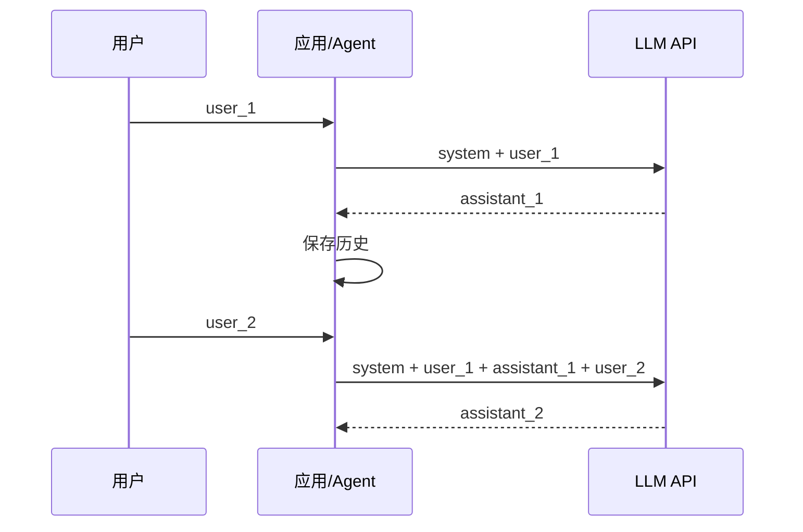

### 3.2 三种 LLM API 协议：Chat Completions、Anthropic Messages 与 Responses

先区分两个容易混在一起的概念：

- **模型推理无状态**：每次生成仍然只依据本次进入 Context Window 的内容，模型参数不会因为一次业务会话而改变；
- **API/平台是否代管会话状态**：供应商可以在模型外部保存 Response、Conversation 等对象，下次调用时重新装配历史。

因此，Responses API 的“有状态”是服务端 orchestration 能力，不是模型突然拥有了跨请求记忆。

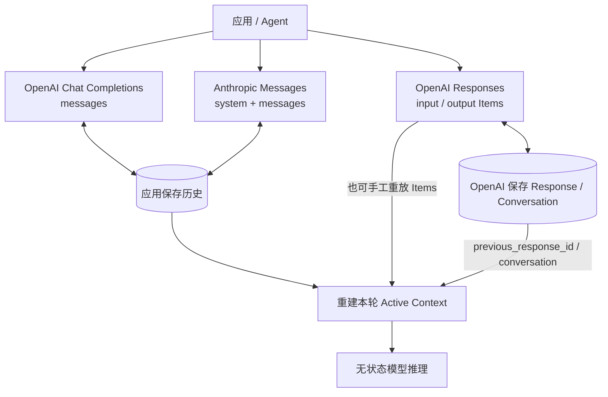

**OpenAI Chat Completions**

- Endpoint：`POST /v1/chat/completions`；
- 输入核心是 `messages[]`，常见角色为 `system`、`user`、`assistant`、`tool`；
- 输出核心位于 `choices[0].message`；
- 多轮历史通常由应用保存并在下一轮重发；
- Function Calling 通过 `tools[].function`、assistant `tool_calls` 和 `role=tool` 消息构成闭环；
- 接口简单、兼容实现多，本项目当前的 `LlmClient` 使用这一协议。

```json
{
  "model": "example-model",
  "messages": [
    {"role": "system", "content": "回答要准确"},
    {"role": "user", "content": "第一问"},
    {"role": "assistant", "content": "第一答"},
    {"role": "user", "content": "追问"}
  ],
  "tools": []
}
```

**Anthropic Messages**

- Endpoint：`POST /v1/messages`；
- `system` 是顶层字段，不是 `messages[]` 中的 `system` role；
- `messages[]` 主要使用 `user` 和 `assistant`，内容由多个 typed content blocks 组成；
- Tool Use 使用 assistant `tool_use` block 和后续 user `tool_result` block；
- 官方将其描述为可用于单次请求或“stateless multi-turn conversations”：应用必须提供前序轮次；
- 请求还要求 `x-api-key` 和 `anthropic-version` 等供应商 Header。

```json
{
  "model": "claude-example",
  "max_tokens": 1024,
  "system": "回答要准确",
  "messages": [
    {"role": "user", "content": "第一问"},
    {"role": "assistant", "content": "第一答"},
    {"role": "user", "content": "追问"}
  ],
  "tools": []
}
```

**OpenAI Responses**

- Endpoint：`POST /v1/responses`，OpenAI 推荐新项目优先使用；
- 输入从单一 `messages[]` 演进为字符串或 typed `input` Items；
- 输出是带 `id`、`status` 和 `output[]` 的 typed Response，message、reasoning、function call、hosted tool trace 可以成为不同 Item；
- 可继续由客户端手工重放 Items，保持无状态和完整上下文控制；
- 也可使用 `previous_response_id` 串联 Response，或使用 Conversations API 保存持久 Conversation；
- 这种服务端状态减少了客户端重复传输历史的网络 payload 和状态管理代码，但不会消除模型侧的历史输入 Token；官方明确说明，链上的历史输入仍会计费；
- `previous_response_id` 不会自动继承上一轮顶层 `instructions`，稳定指令应按官方语义重新发送；
- 需要 Zero Data Retention、精确裁剪或自主管理 Context 时，应选择 `store: false` 并显式传递必要 Items。

```json
{
  "model": "example-model",
  "instructions": "回答要准确",
  "input": "继续解释上一轮",
  "previous_response_id": "resp_123",
  "tools": []
}
```

选择原则：

1. 需要成熟的 OpenAI-compatible 生态和简单消息模型，可继续使用 Chat Completions；
2. 直接使用 Claude 原生能力时，应理解 Anthropic content blocks 和 tool use 语义，而不是只替换 URL；
3. 新建 OpenAI Agent 工作流、需要 hosted tools、typed Items 或服务端 Conversation 时，优先评估 Responses；
4. “服务端代管历史”换来更小的网络请求和更少的客户端状态代码，同时带来数据保留、供应商绑定、分支/删除控制和审计边界，应显式选择而不是默认依赖。

### 3.3 Prompt 和 Context 不宜强行二分

术语没有全球唯一标准，工程中建议使用以下定义：

- **Prompt**：为了触发一次生成而提供的指令或消息；
- **Active Context**：这次推理实际进入模型上下文窗口的全部 Token，包括 system 指令、用户消息、历史、工具定义、工具结果、检索文档和图像等；
- **External Memory**：保存在文件、数据库或向量库中，本次尚未取回模型窗口的信息；
- **Context Engineering**：决定“在何时，把哪些信息，以什么结构，放进有限 Context”的系统工程。

“未输入模型的就是 Context、输入模型的就是 Prompt”不是通行定义。外部存储只有被检索并注入后，才成为本次 Active Context。

### 3.4 从 Prompt Engineering 到 Context Engineering

Prompt Engineering 更关注如何表达指令；Context Engineering 覆盖完整信息管线：

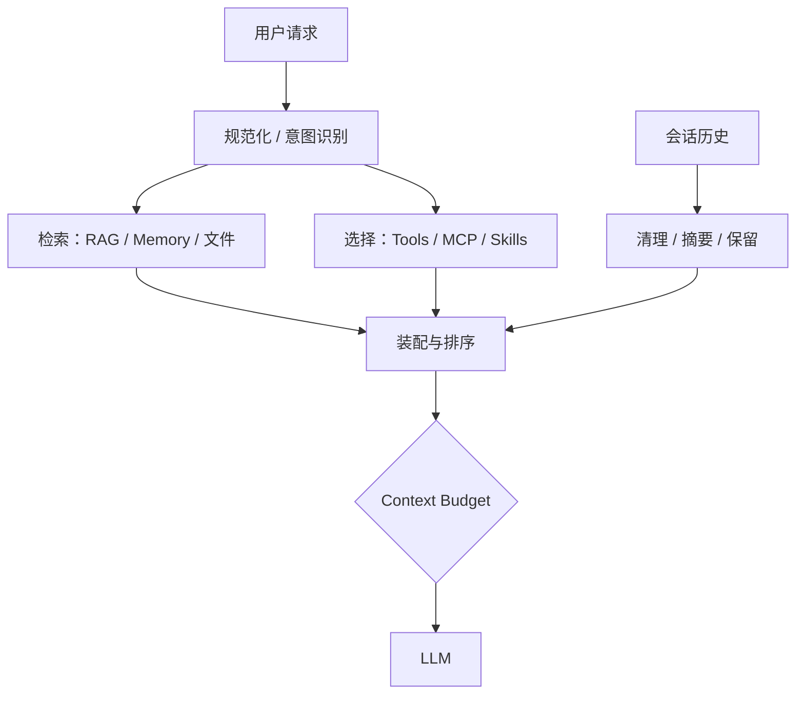

核心目标不是“塞满窗口”，而是：

> 在给定成本和窗口约束下，提供最少但高信号、可行动、来源清楚的信息。

### 3.5 RAG 解决什么，不解决什么

RAG（Retrieval-Augmented Generation）在生成前检索外部资料：

1. 文档切分；
2. Embedding 将文本映射到向量；
3. 根据相似度召回候选；
4. 可用 Reranker 做精排；
5. 把高相关片段和来源加入 Context；
6. 模型据此回答。

关键指标：

- **召回率**：需要的证据是否进入候选集；
- **精度/相关性**：候选中有多少真正有用；
- **Groundedness**：回答是否被证据支持；
- **端到端任务成功率**：用户问题是否真正解决。

RAG 可以补充新知识和私有知识，但不会自动消除幻觉。错误切分、漏召回、提示注入、过期文档和生成阶段误用证据仍会失败。

### 3.6 Prompt Cache 为什么重要

许多供应商会缓存重复的输入前缀。工程原则：

- 稳定的 system prompt、工具定义、公共示例放前面；
- 用户请求和不断变化的工具结果放后面；
- 工具定义及顺序保持稳定；
- 观察 API 返回的 cached token 指标，不凭感觉判断命中；
- 价格、最小可缓存长度、TTL 和写入费用随供应商和模型变化，以当期官方文档为准。

缓存降低的是重复前缀的计算成本和时延，不扩大上下文窗口，也不等于长期 Memory。

---

## 4. Context Engineering 的三个难题

### 4.1 上下文膨胀与注意力稀释

更大的 Context Window 不等于所有位置都被同样利用。历史错误、大段工具输出和互相冲突的指令会造成干扰；相关信息位于长上下文中部时也可能更难被利用。

### 4.2 两种可组合的压缩

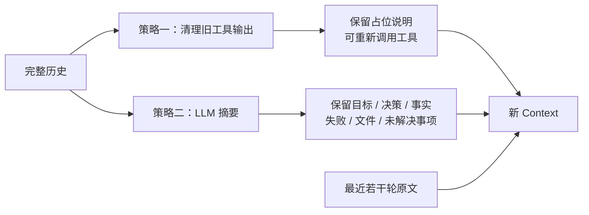

**策略一：Tool Result Clearing**

- 适合可重新获取的大文件内容、搜索结果、构建日志；
- 成本低、规则确定；
- 不能清理唯一且不可恢复的结果；
- 占位符应说明删掉了什么、怎样重新获取。

**策略二：Summary Compaction**

- 适合保留跨多轮的目标、决定、进展和关键发现；
- 会额外调用模型，而且必然有损；
- 应先追求高召回，再删冗余；
- 最近上下文通常应保留原文，避免“刚得到的细节”马上被摘要掉。

两者组合通常优于只用一种：先机械清掉可重取的大块，再对旧轨迹做高保真摘要。

### 4.3 模型会不会“不喜欢压缩自己的记忆”

“不喜欢”是拟人化表述。更有证据支持的说法是：

- 模型没有天然的 Token 成本意识；
- 只用模糊 Prompt 要求“适时压缩”，当前模型往往压缩不频繁；
- 对摘要长度的自然语言要求可能执行不稳定；
- 端到端反复重写会出现 brevity bias 或 context collapse，丢失细节；
- 明确工具、检查点、系统触发阈值和结构化保留字段，通常比期待模型自觉更可靠。

ACE（Agentic Context Engineering）还提醒我们：**运行轨迹摘要**与**长期策略手册**不是一回事。前者应该压缩；后者若反复整体改写，可能越写越短，应采用条目化、增量更新、去重和局部修订。

ACE 是 2025 年提出的具体上下文自适应框架，不是 Context Engineering 的通用定义。其“无标签监督”仍依赖代码执行成败、环境信号等自然反馈；缺少可靠反馈时，自适应同样可能把错误经验写入 playbook。

### 4.4 Memory：模型没有长出新参数

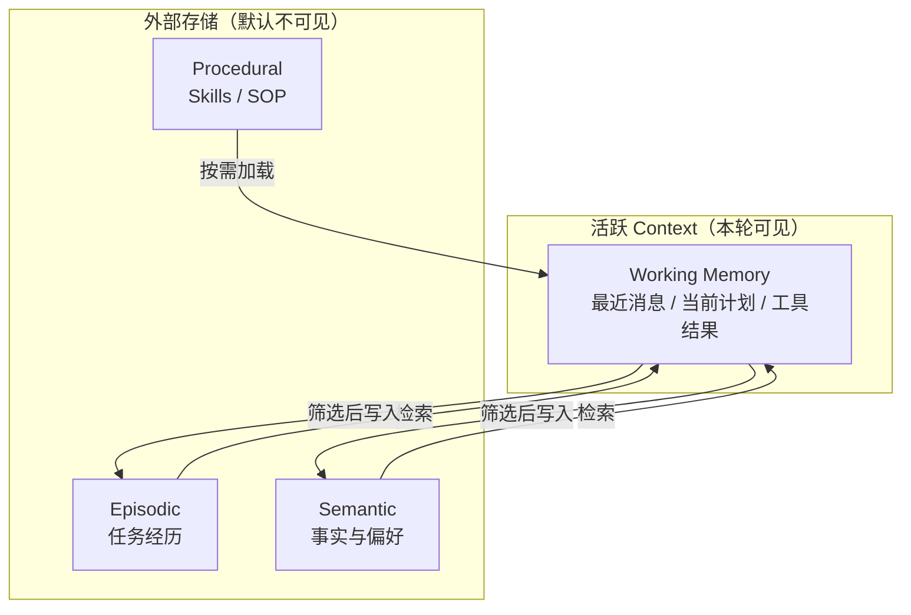

常见 Memory 只是 Agent 把信息存进 `day.log`、JSONL、数据库或向量库，未来再检索进 Context。它带来连续体验，但也有风险：

- 把错误结论长期保存；
- 召回无关内容污染当前任务；
- 用户隐私、保留期限和删除权；
- 多租户越权；
- Prompt Injection 被记忆并长期复现。

“会成长的 Agent”可能更新外部记忆、SOP、Skill 或路由策略；若不改模型权重，就不应表述为“模型自己学习成了新模型”。“角色扮演”只能解释其中一部分，真实系统还包含持久化、检索、评价和更新策略。

#### 4.4.1 参数化与非参数化持续学习

大模型持续学习至少要区分三条路线：

1. **参数化持续学习**：通过继续预训练、Fine-tuning、LoRA、Adapter 或在线梯度更新，把新知识写入模型参数。优点是推理时可以直接利用；难点是训练成本、灾难性遗忘、知识冲突、更新验证和删除困难；
2. **非参数化持续学习**：保持主模型参数不变，把新事实、经历、策略和用户偏好写入外部可更新 Memory，推理时按需检索进 Active Context；
3. **半参数化/混合路线**：外部 Memory 负责快速、可审计的更新，周期性训练再把经过验证的稳定模式蒸馏进模型、Retriever 或 Policy。

这里的“非参数化”不表示系统里没有任何参数化模型：Embedding、Reranker、摘要模型和决策模型仍可能有参数。它强调的是：**新知识没有通过梯度更新写进基础 LLM 权重，而是保存在可读写、可检索、可删除的外部状态中。**

#### 4.4.2 非参数化持续学习的闭环

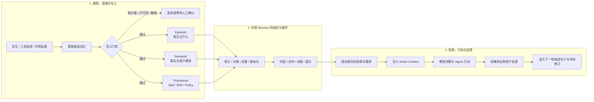

真正的持续学习闭环不只是 `store → search`，还需要：

- **Write policy**：什么值得记、由谁确认、记录事实还是记录推测；
- **Representation**：文本、向量、结构化槽位、时序图或知识图谱；
- **Consolidation / Reconsolidation**：合并重复经历、形成更高层规律，并在新证据出现时修订旧记忆；
- **Retrieval policy**：何时检索、取多少、怎样处理时间、来源和矛盾；
- **Forgetting / Deletion**：过期淘汰、用户删除权、租户隔离和机器遗忘接口；
- **Evaluation**：不仅测召回率，还要测长期任务成功率、错误记忆传播、知识更新、跨会话一致性和成本。

#### 4.4.3 从 RAG 到 Memory

RAG 和非参数化持续学习有共同的“外部存储 + 检索”结构，但关注点不同：

- 传统 RAG 往往面对相对静态的文档库，重点是切分、召回、精排和有依据生成；
- Agent Memory 必须持续写入交互经验，处理时间、身份、来源、冲突、巩固和遗忘；
- RAG 主要解决“这次回答需要哪些资料”，持续学习还要回答“这次经历是否应改变未来行为”；
- 因此，给 RAG 增加一个自动写入接口不等于已经解决持续学习。

HippoRAG 2 将 RAG 明确放到“非参数化持续学习”框架下，用图结构和 Personalized PageRank 改善事实、sense-making 与关联记忆。A-MEM 则借鉴 Zettelkasten，把记忆组织成可动态建立链接、随新证据演化的原子笔记网络。两者都说明研究重点正在从“把文档检索回来”转向“怎样长期组织、更新和利用经验”。

#### 4.4.4 OpenClaw 与 Hermes Agent：成长发生在 Harness 层

2026 年的代表性 Agent 产品 OpenClaw 和 Hermes Agent 都把“成长”实现为模型外部状态和流程的演化，而不是每次会话都重新训练基础模型。

**OpenClaw**

- 通过 `memory_search`、`memory_get` 等工具访问持久化 Memory，并可使用向量与关键词混合检索；
- 日常记录和短期信号可以被整理进长期 `MEMORY.md`；
- 官方 Dreaming 机制按 light → REM → deep 三个阶段做后台巩固：筛选候选、反思主题、把达到门槛的内容提升为长期记忆；
- 巩固过程包含来源、频率、多样性和不可信内容门禁，并把可读摘要写入 `DREAMS.md` 供人检查；
- 模型参数没有因此改变；变化的是 Memory 文件、索引、巩固状态和未来 Prompt。

**Hermes Agent**

- 使用持久化 `MEMORY.md`、`USER.md` 保存事实、偏好和用户模型，并在会话开始时注入有界快照；
- 使用 `skill_manage` 创建、更新和删除程序性 Skills，把复杂工作流沉淀成可复用 `SKILL.md`；
- 后台 self-improvement review 可以在主回答结束后，从轨迹中提取耐久事实或改进 Skill，避免与当前用户任务争夺注意力；
- Memory 和 Skill 写入可开启 approval gate，先暂存变更，再由用户批准或拒绝；
- 这类“自我改进”仍属于可检查的外部 Memory / Skill 学习，不等于 Hermes 底层模型权重持续更新。

两者共同呈现出一个产品化趋势：

```text
会话轨迹
  → 后台评价与筛选
  → 事实写入 Memory
  → 流程沉淀为 Skill
  → 下一次按需检索和加载
  → 根据新反馈继续修订
```

宣传中的“越来越懂你”只有在写入准确、召回相关、冲突可修复、删除可执行且长期任务指标改善时才成立；Memory 变多本身不等于 Agent 变好。

#### 4.4.5 可展开的研究问题

“大模型非参数化持续学习”可以沿以下主线展开：

1. **记忆形成**：怎样从自然语言、工具轨迹和环境反馈中提取可复用知识，同时控制误写和隐私；
2. **动态组织**：怎样在向量、图、事件流、用户模型和程序性 Skill 之间选择或自适应路由；
3. **巩固与遗忘**：怎样合并、抽象、版本化、纠错和安全删除，避免 Memory 无限增长；
4. **可学习的读写策略**：用规则、LLM、强化学习或小模型决定何时写、何时读、读什么；
5. **长期评测**：从静态 QA 转向跨会话、持续变化环境中的 retention、adaptation、transfer 和 task success；
6. **可信持续学习**：处理 Prompt Injection、错误经验自增强、跨用户污染、来源追踪和人类审批；
7. **Memory 到参数的蒸馏**：何时把稳定外部知识周期性转成模型或 Policy 更新，同时保留审计和回滚能力。

### 4.5 Sub-agent 也是 Context 隔离手段

子 Agent 不只是“多找一个模型”：

- 每个子任务使用干净且聚焦的 Context；
- 主 Agent 只接收结论、证据和状态，相当于语义压缩；
- 不同任务可并行；
- 代价是额外调用、协调、冲突处理和来源追踪。

多 Agent 并不天然优于单 Agent。任务无法并行、共享状态很重或协调成本高时，一个带好工具的 Agent 可能更可靠。

本项目现在通过 `delegate_task` 实现一个可观察的同步 Sub-agent：

- 父 Agent 只传 `task + mode + 最小必要 context`，不会复制完整会话；
- 子 Agent 创建独立 `messages`，与父 Agent 的活跃 Context 隔离；
- `research` 模式只有列目录、读文件和搜索能力；
- `workspace` 模式可增加写文件和精确编辑，但仍不能运行 Shell；
- 子工具集不注册 `delegate_task`，从结构上禁止递归委派；
- `SUBAGENT_MAX_STEPS`、`SUBAGENT_MAX_INVOCATIONS` 和结果长度共同限制成本；
- 子 Agent 与父 Agent 复用 LLM Client、工作区边界、日志器和 Token 指标，因此调用可统一审计；
- 当前实现是同步委派，不是并行调度器；它主要演示 Context 隔离、权限收窄和结果压缩。

---

## 5. 从输出 Token 到真实动作

### 5.1 格式化输出

早期做法是在 Prompt 中约定：

```xml
<tool>{"name":"read_file","arguments":{"path":"a.php"}}</tool>
```

Agent 解析标签，查找同名函数，校验参数并执行。问题包括格式容易漂移、转义困难、协议不统一。

现代模型/API 通常支持 Native Function Calling：

```json
{
  "tool_calls": [{
    "id": "call_1",
    "function": {
      "name": "read_file",
      "arguments": "{\"path\":\"a.php\"}"
    }
  }]
}
```

结构化输出减少解析脆弱性，但**不等于安全执行**。名称白名单、JSON Schema 校验、权限、沙箱、超时、幂等性和人工确认仍属于 Agent runtime 的职责。

### 5.2 一次完整工具循环

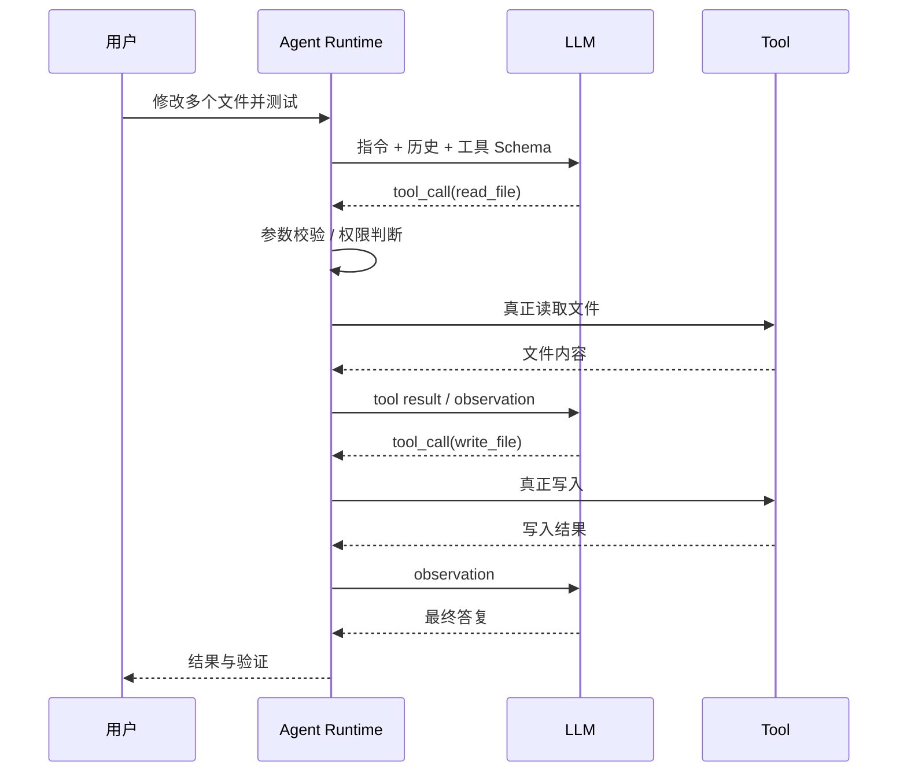

模型输出 Bash 命令或 API 参数，不代表命令已经运行。只有日志中的工具执行结果才能证明动作发生过。

### 5.3 MCP 是连接协议，不是 Agent

MCP 用 JSON-RPC 2.0 标准化 Host、Client 和 Server 之间的连接。Server 可暴露：

- **Tools**：可执行能力；
- **Resources**：可读取的数据和上下文；
- **Prompts**：可复用模板。

MCP 解决“怎样发现和调用能力”的互操作问题，不负责：

- 判断何时该调用；
- 保证工具描述可信；
- 自动完成鉴权和业务授权；
- 防止数据外泄或危险操作；
- 替代 Agent loop。

#### 5.3.1 MCP 与三种 LLM API 不在同一层

Chat Completions、Anthropic Messages 和 Responses 是 **Agent Host 调模型**的推理协议；MCP 是 **Agent Host 连接外部工具和数据服务**的集成协议。它们不是四选一，而是可以组合：

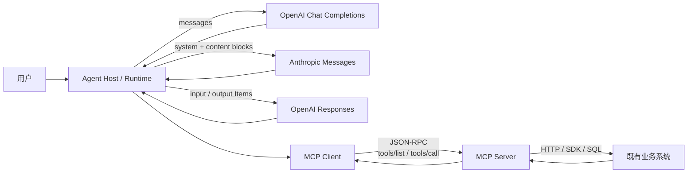

对比时应抓住四条边界：

1. **调用对象**：LLM API 调模型；MCP 调能力提供方；
2. **核心载荷**：LLM API 传 Prompt、Messages 或 Items；MCP Tools 传 name、JSON Schema、arguments 和 result；
3. **状态语义**：Chat Completions/Anthropic Messages 通常由应用重放历史，Responses 可选服务端状态；MCP 是有初始化和能力协商的连接协议，但业务会话和用户身份仍由 Host/Server 设计；
4. **工具闭环**：模型只生成工具调用意图，Agent Host 执行本地 Tool 或通过 MCP Client 调远端 Tool，再把结果转换回模型协议。

#### 5.3.2 从已有 HTTP API 转成 Agent Tool

“把 API 转成 Tool”不是把 URL 原样交给模型，而是建立受控适配层：

- HTTP `method + path` 转为稳定、语义化的 Tool name；
- API 业务说明转为 Tool description，帮助模型判断何时调用；
- query/body 参数转为严格 `inputSchema`，隐藏 token、内部 host 和不可控 Header；
- API response 转为 Tool `content` 或 `structuredContent`，并设置大小、分页和字段边界；
- Adapter 在服务端维护 Tool name 到固定 API dispatch entry 的 allowlist，拒绝模型猜测任意路径；
- 原 API 的认证、操作权限、对象数据范围和字段权限仍是最终安全边界。

这就是 MCP Server 的价值：它把现有 Web API 的“面向前端调用契约”适配成 Agent 可以发现、理解和调用的工具契约，但不应复制一套新的业务权限系统。

#### 5.3.3 Salora CRM MCP Server 案例

本地案例由三个项目共同组成：

- 当前 PHP Agent：`/Users/workspace-llm/my-agent`；
- Streamable HTTP MCP Server：`/Users/workspace-lb/crm-salora-mcp-server`；
- RAG + QA Bot / AI Platform 迭代设计：`/Users/workspace-lb/TMGM-CRM-Back-End-update/docs/crmcn-12269`。

其中两份核心设计文档分别回答：

1. `01-crmcn-12455-api-to-ai-tool-mcp-poc-design.md`：HTTP API 怎样演进为前端 Tool Executor、CRM Tools Gateway 和独立 MCP Server；
2. `02-crmcn-12467-salora-api-permission-audit.md`：为什么“页面能调用”不等于“可以安全开放给 AI”，以及 authentication、portal/role、operation、data/object、field 五层门禁。

12455 给出的不是一次性重写，而是共享同一 API Catalog 的三阶段演进：

1. **Stage 1：前端 Tool Executor**。Salora 浏览器复用当前登录用户 CRM token 和已有 API service，最低成本验证页面助手闭环；这是推荐 POC 路径，仍处于设计/评审状态；
2. **Stage 2：CRM Tools Gateway**。由 Laravel CRM 提供服务端连续调用和组合能力，需要 delegated credential，并显式补齐绕过原 route 时的权限判断；当前是设计态；
3. **Stage 3：独立 MCP Server**。面向多 Agent 和多系统提供标准 `tools/list/tools/call`；当前已有两个 read-only Tool 的薄适配 POC。

API Catalog 文档覆盖 76 个 operation 和 220 个 schema，但不是全部发布给模型。当前源码 Catalog 只启用：

- `salora.salesLeadsClientList`；
- `salora.salesDashboardSectionPerformance`。

其余 operation 因权限审计、Schema 完整度或发布状态未通过而在构建期排除。Catalog 是能力 allowlist，不是第二套 ACL。

Salora MCP Server 是一个无状态 Streamable HTTP Gateway：

- Endpoint：`POST /mcp`，健康检查：`GET /healthz`；
- 通过 `tools/list` 只发布 Catalog allowlist 中的只读工具；
- 通过 `tools/call` 校验 JSON Schema，再把参数转换为固定 CRM HTTP query/body；
- 从 MCP 请求 Header `X-CRM-Authorization` 取得当前用户短期 JWT；
- 下游固定转换成 CRM `Authorization: Bearer ...`；
- token 不是 Tool 参数，模型不会看到，Server 也不记录；
- CRM response 进入 `content` 和 `structuredContent`，业务错误标记为 `isError`。

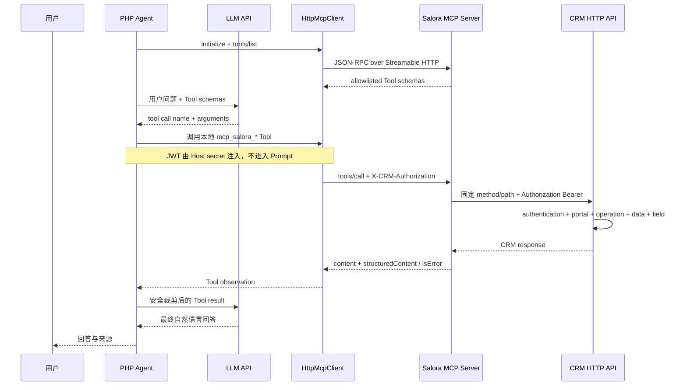

用户提供的浏览器请求可安全提取出：

- CRM Base URL：`http://localhost:18080/api/`；
- API version media type：`application/prs.CRM-Back-End.v2+json`；
- 认证类型：短期 Bearer JWT；
- 页面来源：`http://localhost:15173`。

真实 JWT 只写入被 Git 忽略的本地 `.env`，不能进入示例、Prompt、日志或提交。对应本地联调配置：

```dotenv
SALORA_MCP_ENABLED=1
SALORA_MCP_URL=http://127.0.0.1:3001/mcp
SALORA_MCP_TOKEN_HEADER=X-CRM-Authorization
SALORA_MCP_TOKEN=本地短期JWT
```

```bash
cd /Users/workspace-lb/crm-salora-mcp-server
MCP_PORT=3001 CRM_BASE_URL=http://localhost:18080/api/ npm start
```

当前 PHP Agent 新增 `HttpMcpClient`，支持 Streamable HTTP 的 JSON 和 SSE 响应，并把远端 Tool name 安全转换为 OpenAI-compatible function name。实际联调已通过 `salora.salesLeadsClientList` 读取本地 CRM，返回 HTTP 200。

必须强调：用户 curl 中的 `memberAccountType/list` 目前不在该 MCP Server 的发布 allowlist 中，因此“连接成功”不等于模型可以调用任意 CRM URL。若要增加此能力，应先补 API Catalog、Tool Schema 和权限审计，再发布新 Tool，而不是开放通用 HTTP 代理。

### 5.4 Skills 是按需加载的程序性知识

典型 Skill 是含 `SKILL.md` 的目录，采用三级渐进式披露：

1. 启动时只加载 `name + description`；
2. 任务匹配时读取完整 `SKILL.md`；
3. 引用资料、脚本和模板再按需读取或执行。

这同时解决两个问题：

- 用户不用每次重写组织内部 SOP；
- 大量操作手册不必全部占据 Context。

MCP 和 Skills 不互相替代：**MCP 更像标准插座，Skill 更像操作手册；工具是手，Skill 告诉手怎样完成特定工作。**

---

## 6. Agent 架构

### 6.1 ReAct：边观察边行动

ReAct 的公开论文形式交错生成 reasoning trace 和 action。生产系统未必展示模型私有推理，工程上更适合观察：

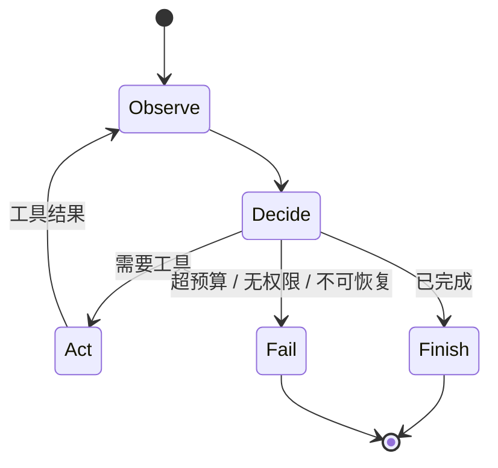

优点：能根据真实反馈纠错，适合探索性任务。  
缺点：每一步可能调用大模型，时延和 Token 成本高，局部决策可能绕路。

### 6.2 Plan-and-Execute：先拆解再执行

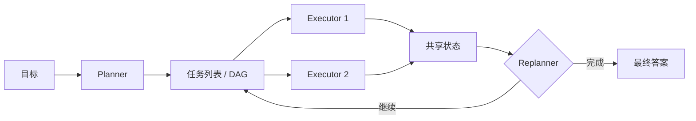

优点：

- 全局拆解更清晰；
- 子任务可用更小模型或并行执行；
- 每个 Executor 只拿需要的 Context。

缺点：

- 初始计划可能基于错误假设；
- 共享状态和依赖管理复杂；
- 必须允许 Replan，不能把计划当成事实。

IDE 中的 Plan 模式、Todo 列表、主 Agent + 子 Agent，名称不同但常包含类似思想。

### 6.3 ACI：为 Agent 设计好用的计算机界面

SWE-agent 提出的 Agent-Computer Interface（ACI）核心观点不是“发明工具调用”，而是：接口设计会显著影响 Agent 行为和成功率。面向模型的工具应：

- 名称、参数和错误信息清晰；
- 输出短而高信号，可分页或按范围读取；
- 支持精确编辑而非总是重写整个文件；
- 让状态、边界和失败可观察；
- 尽量可恢复、可重试、可验证。

这与 MCP 的设计哲学相关，但二者不能画等号：ACI 是面向 Agent 的接口设计原则，MCP 是互操作协议。

---

## 7. AI 编程与 Agent 产品形态的演进

这不是严格、互斥的“代际标准”，而是能力边界逐步外扩：

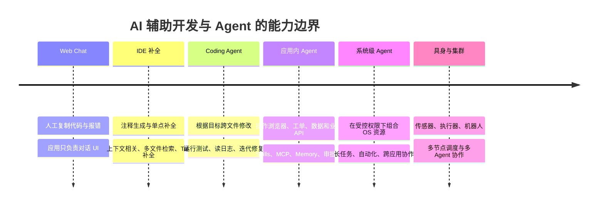

需要警惕两种营销化叙事：

1. 能调用 OS 工具不等于“整个操作系统管理员”；生产环境必须遵守最小权限和审批；
2. “天网”适合作为科幻类比，不是一个可验证的 Agent 技术阶段。跨机器集群本质上还需要调度、身份、状态一致性、容错和安全工程。

---

## 8. 从 0 到 1 的 PHP 教学实现

项目版本刻意逐层增加能力：

1. `bin/00_chat.php`：单次 Chat，请求结束即无状态；
2. `bin/01_prompt_tools.php`：Prompt 约定 `<tool>` 标签，程序解析并执行；
3. `bin/02_native_function_call.php`：原生 Function Calling，但只执行一次，说明“工具调用 ≠ Agent loop”；
4. `bin/03_react_agent.php`：重复“模型决策 → 工具执行 → Observation”；
5. `bin/04_plan_execute.php`：Planner 拆任务，Executor 分步完成，最后汇总；
6. `bin/05_modern_agent.php`：Native Tools + stdio/HTTP MCP + Skills + Memory + Context Compaction + Sub-agent；
7. `bin/06_compare_models.php`：让云端与 Ollama 模型执行完全相同的 Agent 任务并统计结果；
8. `bin/chat.php` / `bin/agent`：类似 Coding Agent CLI 的多轮终端会话，复用现代 Agent 全部能力；
9. `examples/snake.html`：可直接打开的单文件贪吃蛇成品，用于无 API 的静态演示。

### 8.1 环境配置

PHP 8.2+ 且启用 `curl`、`json`、`mbstring`。项目不依赖框架或第三方 Composer 包；`composer.json` 只声明 PSR-4 类映射和运行环境，便于 IDE 建立引用。未生成 `vendor/autoload.php` 时仍可使用内置降级自动加载。项目会自动加载根目录 `.env`，Shell 中已存在的变量优先。

```bash
LLM_BASE_URL=https://api.deepseek.com/v1
LLM_API_KEY=你的密钥
LLM_MODEL_ID=deepseek-v4-flash

LOCAL_LLM_BASE_URL=http://127.0.0.1:11434/v1
LOCAL_LLM_API_KEY=ollama
LOCAL_LLM_MODEL_ID=qwen3.6:35b

AGENT_TRACE=1
SUBAGENT_MAX_STEPS=6
SUBAGENT_MAX_INVOCATIONS=4

# 可选：Salora Streamable HTTP MCP
SALORA_MCP_ENABLED=0
SALORA_MCP_URL=http://127.0.0.1:3000/mcp
SALORA_MCP_TOKEN_HEADER=X-CRM-Authorization
SALORA_MCP_TOKEN=本地短期JWT
```

只要服务兼容 OpenAI Chat Completions，便可替换 Base URL 和模型。`LLM_MODEL` 仍作为旧配置别名兼容，但优先使用 `LLM_MODEL_ID`。不同厂商及本地模型对 `tool_calls` 的细节支持仍需实测。`bin/00_chat.php` 至 `bin/05_modern_agent.php` 都支持 `--profile=default|cloud|local`；不传时保持原行为，读取 `LLM_*` 默认配置。

### 8.2 三种共存运行方式

**版本一：单任务、单进程**

适合从零演示 Agent loop。直接读取本仓库 `.env`，完成一个目标后退出，不进入 Chat：

```bash
cd /Users/workspace-llm/my-agent
php bin/05_modern_agent.php --profile=cloud "创建并验证一个单文件 HTML 贪吃蛇"
php bin/05_modern_agent.php --profile=local "创建并验证一个单文件 HTML 贪吃蛇"
```

`bin/00_chat.php` 至 `bin/06_compare_models.php` 均继续独立运行，没有被交互版替代。

**版本二：当前项目内的交互式 Agent**

在本仓库启动，多轮 messages、Tools、MCP、Skills、Memory、Context Compaction、Sub-agent 和 JSONL 日志都持续有效：

```bash
cd /Users/workspace-llm/my-agent
./bin/agent
# 等价于 php bin/chat.php
```

**版本三：任意项目的 Coding Agent**

启动时的当前目录默认就是 Agent 工作区，因此可先进入任意项目，再调用 Agent 的绝对路径：

```bash
cd /path/to/your-project
/Users/workspace-llm/my-agent/bin/agent
```

可选地创建全局命令：

```bash
mkdir -p ~/.local/bin
ln -sfn /Users/workspace-llm/my-agent/bin/agent ~/.local/bin/my-agent
export PATH="$HOME/.local/bin:$PATH"

cd /path/to/your-project
my-agent
```

LLM 配置始终读取 Agent 仓库自己的 `.env`，不会把目标项目的 `.env` 当成模型密钥配置。默认使用云端 profile；只有性能对比时显式运行 `my-agent --profile=local`。

项目级 CLI 提供 `search_files`、`read_file`、`write_file`、`edit_file`、`run_command` 和 `delegate_task`。Sub-agent 的 `research` 模式只读，`workspace` 模式可修改文件但不能执行 Shell；父 Agent 的 Shell 命令仍默认逐次显示并请求确认。`--no-shell` 可完全禁用父 Agent 命令工具，`--yes` 会自动批准，仅应在隔离环境中使用。

终端内置命令：

- `/help`：查看帮助；
- `/clear`：清空活跃对话，不删除外部 Memory；
- `/history [数量]`：查看最近消息摘要；
- `/metrics`：查看累计调用次数、Token 和耗时；
- `/compact`：主动摘要旧上下文；
- `/model`、`/workspace`：查看当前配置；
- `/exit`：退出。

默认不在终端打印完整 API JSON，以保持 Chat 可读；完整事件仍写入 `var/logs/chat-*.jsonl`。加 `--trace` 可同时在终端展示原始请求、响应和工具事件。

### 8.3 依次演示

```bash
php bin/00_chat.php
php bin/01_prompt_tools.php
php bin/02_native_function_call.php
php bin/03_react_agent.php
php bin/04_plan_execute.php
php bin/05_modern_agent.php
php bin/06_compare_models.php
./bin/agent
```

上述 `00` 至 `05` 任一脚本都可追加 `--profile=cloud` 或 `--profile=local`，便于用完全相同的演示任务切换模型。

所有 LLM 请求、响应、工具调用和 MCP 消息都会写入 `var/logs/*.jsonl`，且默认同步打印到终端。另开窗口观察最新日志：

```bash
tail -f "$(ls -t var/logs/*.jsonl | head -1)"
```

每一行都是一个 JSON 事件，重点观察：

- `llm.request`：本轮完整 messages、tools 和模型参数；
- `llm.response`：模型原始响应和 usage；
- `tool.request / tool.response`：模型“想做什么”与程序“实际做了什么”；
- `mcp.request / mcp.response`：MCP 只是另一层协议消息；
- `mcp.http.request / mcp.http.response`：Streamable HTTP MCP 请求和响应，日志只记录自定义 Header 名，不记录 JWT 值；
- `subagent.started / subagent.completed / subagent.failed`：父 Agent 的委派边界、模式、结果长度与失败原因；
- `context.tool_results_cleared / context.compacted`：上下文何时被清理或摘要。

为保护密钥，Authorization Header 从不写入日志；但业务 Prompt 和工具数据会记录，生产环境必须做脱敏、访问控制和保留期限管理。

### 8.4 现代 Agent 生成贪吃蛇时的交互

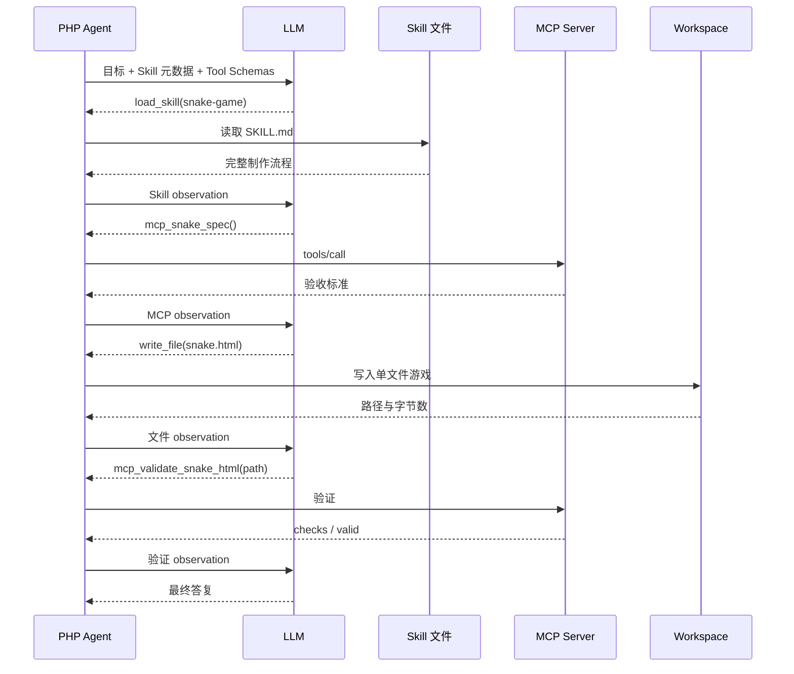

直接打开预置成品：

```bash
open examples/snake.html
```

Modern Agent 生成的新文件位于 `var/workspaces/modern/snake.html`。

### 8.5 测试

```bash
php tests/run.php
```

默认测试不调用外部 LLM，覆盖工作区边界、Sub-agent 权限收窄和工具 Schema、Skill 渐进加载、外部 Memory、旧工具输出清理、MCP 工具发现、HTTP transport 参数校验和贪吃蛇验收。另用云端模型完成了只读 Sub-agent 实际调用，并用本地 CRM JWT 完成了 Salora MCP Tool 联调。

### 8.6 云端模型与本地模型对比

对比脚本给两个模型相同的 system prompt、用户任务、工具 Schema、最大循环次数和独立空工作区。任务要求模型依次查看目录、写入严格 JSON、读回验证，因此测试的是完整 Agent loop，而不只是聊天回答。

```bash
# 两边都运行
AGENT_TRACE=0 php bin/06_compare_models.php

# 单独运行，便于定位配置或模型问题
AGENT_TRACE=0 php bin/06_compare_models.php --profile=cloud
AGENT_TRACE=0 php bin/06_compare_models.php --profile=local
```

`06` 的旧位置参数 `cloud`、`local` 仍兼容；新命令统一推荐 `--profile`。

输出记录任务是否真正通过、LLM 调用次数、输入/输出 Token、LLM 累计耗时、端到端耗时和观测到的输出吞吐。这里的吞吐以 API 往返时间计算，包含 Prompt 处理、首 Token 等待和网络耗时，不等于模型引擎报告的纯解码 Token/s。

公平比较时应：

1. 先让 Ollama 完成模型加载和一次预热，把冷启动单独记录；
2. 同一任务至少运行 3—5 次，分别报告中位数和波动；
3. 固定 Prompt、工具顺序、Context、温度、轮数上限和验收器；
4. 同时看任务成功率、工具调用轮数、Token、端到端时间和资源占用；
5. 记录本地模型的量化等级、总参数、激活参数、Context 长度及机器内存；
6. 不把“本地无 API 账单”误写成零成本，也不把 MoE 直接等同于一定更快。

2026-07-19 的同批对照中，两边均用 4 次 LLM 调用完成任务并通过同一文件验收。`deepseek-v4-flash` 输入 2,888 Token、输出 390 Token，端到端约 10.25 秒，观测吞吐 38.11 输出 Token/s；预热后的本地 `qwen3.6:35b` 输入 2,917 Token、输出 345 Token，端到端约 22.45 秒，观测吞吐 15.39 输出 Token/s。Qwen 首次冷运行约 35.77 秒、9.64 输出 Token/s，说明模型加载和预热会显著影响本地数据。在这个小任务上云端约快 2.2 倍，但一次任务不能外推为普遍性能排名。

Ollama 报告该本地模型为 36.0B 参数、GGUF Q4_K_M、23 GB，架构族为 `qwen35moe`，共有 256 个专家、每个 Token 使用 8 个专家，上下文上限 262,144，并声明支持 tools 与 thinking。MoE 的稀疏激活能减少相对同规模稠密模型的部分计算，但实际速度仍由共享层、激活参数、量化、内存带宽、Context 和推理后端共同决定。

同日运行完整 Modern Agent 贪吃蛇任务时，`deepseek-v4-flash` 依次完成 Skill 加载、MCP 规范读取、13,876 字节 HTML 写入和 MCP 验证，共调用 LLM 5 次：输入 16,518 Token、输出 4,939 Token、合计 21,457 Token，LLM API 累计约 39.73 秒；其中供应商报告 14,592 个输入 Token 命中缓存。这组数据直观展示了：用户最初只有一句话，但多轮工具 Schema、历史、Skill 和生成文件会迅速放大 Agent 的累计 Token。

---

## 9. 名词串讲：先建立地图

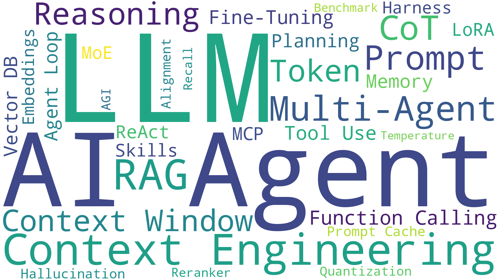

> 词云大小采用本次分享的编排权重，用于快速建立感性认识；它不是经过统一数据源验证的真实搜索指数或技术重要性排名。

### 模型与训练

- **LLM**：大语言模型；
- **Transformer**：主流序列建模架构；
- **Fine-tuning**：在预训练模型上继续训练以改变行为或能力；
- **LoRA**：低秩参数高效微调；
- **MoE**：每个 Token 只激活部分专家网络的稀疏架构；
- **Quantization**：降低权重/激活数值精度以节省显存和算力；
- **Alignment / RLHF**：让模型行为更符合人类偏好和安全目标的一类方法；
- **AIGC**：AI 生成内容的产品类别；
- **AGI**：定义不统一的通用人工智能目标，不是可直接验收的单一技术指标。

### 推理与输入

- **Token**：模型读写的离散单位；
- **Context Window**：单次推理可处理的上下文上限；
- **Prompt**：触发生成的指令或消息；
- **Temperature**：采样随机性参数；
- **CoT**：通过中间推理步骤改善复杂任务的方法；产品不一定暴露内部推理；
- **Reasoning Model**：针对复杂推理和测试时计算优化的一类模型；
- **Hallucination**：生成流畅但缺乏事实依据或与证据冲突的内容。

### 知识与检索

- **Embedding**：把内容映射为向量表示；
- **Vector DB**：针对向量相似度检索优化的存储；
- **RAG**：检索后把证据加入生成上下文；
- **Reranker**：对粗召回候选做更精细的相关性排序；
- **Recall / 召回率**：应命中的内容有多少被找回。

### Agent 工程

- **Function Calling / Tool Use**：模型结构化表达调用意图；
- **Agent**：围绕模型组织状态、工具和控制循环的软件系统；
- **Harness / Scaffold**：承载模型、工具、循环、权限和日志的外围运行框架；
- **ReAct**：交错推理/决策、行动和观察的范式；
- **Loop**：持续调用模型和工具直至结束条件；
- **Planning**：显式分解目标和依赖；
- **Multi-Agent**：多个角色或上下文协作；
- **Memory**：跨轮或跨任务保存并检索信息的机制；
- **MCP**：连接 AI 应用与外部能力的标准协议；
- **Skills**：按需加载的程序性知识、脚本和资源包；
- **Benchmark**：在固定任务和指标上评估系统，如 MMLU、SWE-bench；榜单分数不等于生产价值。

### Context Engineering

- **Context Selection**：选哪些信息；
- **Context Compression / Compaction**：清理、摘要或重组历史；
- **Prompt Cache**：复用相同输入前缀的推理计算；
- **Context Rot / Distraction**：上下文增长后，相关信号被干扰；
- **Short-term / Working Memory**：当前任务活跃状态；
- **Long-term Memory**：窗口之外可持久化、可检索的信息。

### 关于“词云热度”

没有数据来源、时间范围、地区和查询口径的手工权重，只能作为视觉设计，不能称为“基于网络热度与搜索指数”。如果要做客观词云，应：

1. 固定 2024—2026、地区和中英文同义词；
2. 选择可复现数据源，如 Google Trends、论文语料、GitHub 代码搜索或招聘 JD；
3. 归一化不同来源，公开采集日期和权重公式；
4. 区分存量大词（AI、LLM）和增长快词（MCP、Skills）；
5. 把图标为“关注度代理指标”，不要把搜索量解释成技术重要性。

分享现场更建议先用上面的分类地图，再用词云做气氛页。

---

## 10. 生产落地检查单

### 正确性

- 任务是否有可自动验证的结束条件；
- 工具结果是否被模型误当成指令；
- 是否保留来源、版本和时间；
- 是否为 Agent 轨迹建立回归集，而不只测单轮答案。

### 成本与性能

- 统计每个任务的输入、缓存输入、输出、工具调用和总时延；
- 对大工具输出分页、裁剪或提供摘要；
- 固定前缀，提升缓存命中；
- 简单子任务使用规则、小模型或普通程序；
- 设置最大轮数、Token、时间和费用预算。

### 安全

- 工具最小权限，读写目录白名单；
- Shell、数据库写入、付款、发送消息等高风险动作需要审批；
- 隔离不可信代码，设置 CPU、内存、网络和时间限制；
- 防 Prompt Injection、工具描述投毒和 Memory 污染；
- 密钥不进入 Prompt、日志和模型可读文件；
- MCP Server 和 Skill 都按代码供应链管理，不能因为“标准化”就默认可信。

### 可观测性

- 保存请求、响应、工具参数、结果、错误、重试和压缩事件；
- 为每次任务分配 trace/session id；
- 区分“模型提出调用”“runtime 执行成功”“业务结果验证通过”；
- 日志脱敏、分权访问并设置保留期限。

---

## 11. 建议的 60 分钟分享节奏

1. **5 分钟：祛魅**  
   用“参数化知识快照 + 逐 Token 生成”建立心智模型，同时讲清限定。
2. **12 分钟：无状态与三种 LLM API**
   对比 Chat Completions、Anthropic Messages、Responses 的消息结构、状态归属和工具语义。
3. **10 分钟：从模型输出到业务 Tool**
   Native Function Calling、MCP Tools，以及 Salora HTTP API → MCP Tool → CRM 权限链。
4. **10 分钟：Agent loop、规划与委派**
   对比 ReAct、Plan-and-Execute 和隔离 Context 的 Sub-agent。
5. **10 分钟：现代 Context Engineering**
   从 RAG、Memory 到非参数化持续学习，并用 OpenClaw、Hermes 说明外部记忆、巩固和 Skills 演化。
6. **10 分钟：两个完整演示**
   Salora MCP 只读查询；`load_skill → MCP spec → write_file → MCP validate → 浏览器打开`。
7. **3 分钟：安全、成本与结论**。

可用三句话收尾：

1. **模型负责生成下一步最可能有用的 Token，系统负责把它约束成可靠行为。**
2. **Agent 的上限受模型影响，稳定性更多取决于 Context、工具接口、验证和安全工程。**
3. **先把任务做成可观察、可执行、可验证的普通软件流程，再让 LLM 决定其中不确定的部分。**

---

## 12. 参考资料

### 基础与检索

1. Vaswani et al., *Attention Is All You Need* (2017): https://arxiv.org/abs/1706.03762
2. Brown et al., *Language Models are Few-Shot Learners* (2020): https://arxiv.org/abs/2005.14165
3. Lewis et al., *Retrieval-Augmented Generation for Knowledge-Intensive NLP Tasks* (2020): https://arxiv.org/abs/2005.11401
4. Liu et al., *Lost in the Middle: How Language Models Use Long Contexts* (2023): https://arxiv.org/abs/2307.03172

### Agent 与接口

5. Yao et al., *ReAct: Synergizing Reasoning and Acting in Language Models* (2022/ICLR 2023): https://arxiv.org/abs/2210.03629
6. Yang et al., *SWE-agent: Agent-Computer Interfaces Enable Automated Software Engineering* (2024): https://arxiv.org/abs/2405.15793
7. LangChain, *Plan-and-Execute Agents*: https://www.langchain.com/blog/planning-agents
8. LangGraph Plan-and-Execute 示例: https://github.com/langchain-ai/langgraph/tree/main/examples/plan-and-execute

### Context Engineering 与 Memory

9. Mei et al., *A Survey of Context Engineering for Large Language Models* (2025): https://arxiv.org/abs/2507.13334
10. Zhang et al., *Agentic Context Engineering: Evolving Contexts for Self-Improving Language Models* (2025): https://arxiv.org/abs/2510.04618
11. *Active Context Compression: Autonomous Memory Management in LLM Agents* (2026): https://arxiv.org/abs/2601.07190
12. *Parallel Context Compaction for Long-Horizon LLM Agent Serving* (2026): https://arxiv.org/abs/2605.23296
13. Anthropic, *Effective context engineering for AI agents*: https://www.anthropic.com/engineering/effective-context-engineering-for-ai-agents
14. Gutiérrez et al., *From RAG to Memory: Non-Parametric Continual Learning for Large Language Models / HippoRAG 2* (2025): https://arxiv.org/abs/2502.14802
15. Xu et al., *A-MEM: Agentic Memory for LLM Agents* (NeurIPS 2025): https://arxiv.org/abs/2502.12110
16. OpenClaw, *Memory*: https://docs.openclaw.ai/concepts/memory/
17. OpenClaw, *Dreaming*: https://docs.openclaw.ai/concepts/dreaming
18. Nous Research, *Hermes Agent*: https://github.com/NousResearch/hermes-agent
19. Hermes Agent, *Persistent Memory*: https://hermes-agent.nousresearch.com/docs/user-guide/features/memory
20. Hermes Agent, *Skills System*: https://hermes-agent.nousresearch.com/docs/user-guide/features/skills

### 协议、Skills 与缓存

21. OpenAI, *Chat Completions API Reference*: https://platform.openai.com/docs/api-reference/chat
22. Anthropic, *Messages API Reference*: https://docs.anthropic.com/en/api/messages
23. OpenAI, *Migrate to the Responses API*: https://developers.openai.com/api/docs/guides/migrate-to-responses
24. OpenAI, *Conversation state*: https://developers.openai.com/api/docs/guides/conversation-state
25. Model Context Protocol, *Tools Specification*: https://modelcontextprotocol.io/specification/2025-11-25/server/tools
26. Model Context Protocol Specification: https://modelcontextprotocol.io/specification/2025-11-25
27. CRMCN-12455, *Salora API 转 AI Tool / MCP 技术方案*: https://thebidgroup.atlassian.net/browse/CRMCN-12455
28. CRMCN-12467, *Salora API 操作权限与数据权限审计*: https://thebidgroup.atlassian.net/browse/CRMCN-12467
29. Agent Skills 开放规范: https://agentskills.io/home
30. Anthropic, *Equipping agents for the real world with Agent Skills*: https://www.anthropic.com/engineering/equipping-agents-for-the-real-world-with-agent-skills
31. OpenAI, *Prompt Caching*: https://developers.openai.com/api/docs/guides/prompt-caching

### 可继续参考的开源实现

32. Datawhale, *hello-agents*: https://github.com/datawhalechina/hello-agents
33. *ai-agents-from-zero*: https://github.com/didilili/ai-agents-from-zero
34. *learn-claude-code*: https://github.com/shareAI-lab/learn-claude-code
35. Anthropic, *claude-code*: https://github.com/anthropics/claude-code
36. *free-claude-code*: https://github.com/Alishahryar1/free-claude-code
37. Petroni et al., *Language Models as Knowledge Bases?* (2019): https://arxiv.org/abs/1909.01066
38. OpenAI, *Function Calling*: https://platform.openai.com/docs/guides/function-calling
39. Anthropic, *Building effective agents* (2024): https://www.anthropic.com/engineering/building-effective-agents
40. Packer et al., *MemGPT: Towards LLMs as Operating Systems* (2023): https://arxiv.org/abs/2310.08560
41. Anthropic, *How we built our multi-agent research system* (2025): https://www.anthropic.com/engineering/multi-agent-research-system

论文版本、API 行为和价格会变化；正式分享前应再次检查链接、修订日期和供应商文档。
