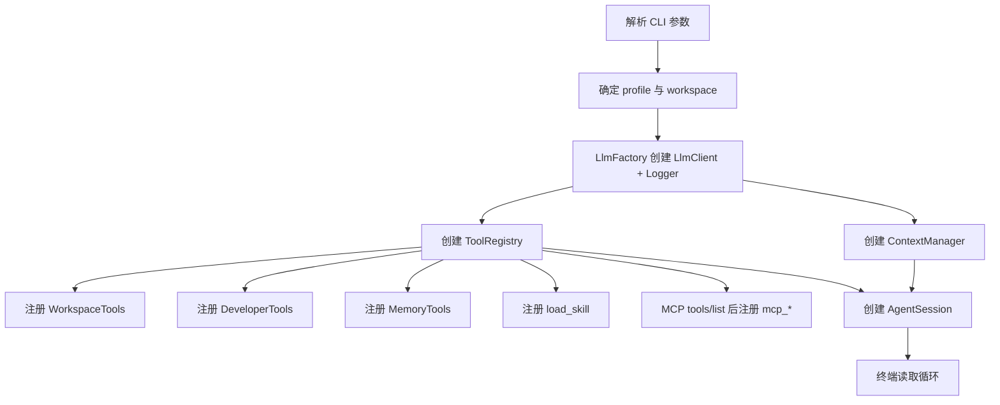

# PHP LLM Agent 项目源码导读

> 用途：分享者备课，不是面向听众的演示稿。
> 目标：在分享前建立“能顺着源码讲清楚、能解释取舍、能回答追问”的理解。
> 对外分享材料仍是 `docs/llm-agent-sharing.md`；本文更关注当前仓库实际实现了什么。

## 1. 先用一句话理解这个项目

这是一个**不用 Agent 框架、只用 PHP 标准能力和 OpenAI-compatible API，从零演进出来的教学型 Agent runtime**。

它的核心不是某个 Prompt，而是下面这条闭环：

```text
用户目标
  ↓
Agent 保存并装配 messages + tools
  ↓
LLM 返回普通文本或 tool_calls
  ↓
PHP runtime 校验并执行工具
  ↓
工具结果以 role=tool 放回 messages
  ↓
再次请求 LLM，直到模型不再调用工具
  ↓
最终回答
```

最值得记住的代码关系是：

```text
bin/*                         负责装配和启动
  ├─ LlmFactory              根据环境创建 LlmClient 和日志器
  ├─ ToolRegistry            把各种能力统一成 Function Calling 工具
  ├─ AgentLoop/AgentSession  驱动“模型 → 工具 → observation”循环
  ├─ ContextManager          控制活跃上下文体积
  └─ MCP / Skills / Memory   给 Agent 增加协议、程序性知识和长期状态
```

### 1.1 模型和程序各自负责什么

LLM 负责：

- 根据当前上下文判断下一步；
- 生成回答；
- 生成结构化 `tool_calls`；
- 在压缩上下文时生成摘要。

PHP runtime 负责：

- 保存和重放消息历史；
- 把工具 schema 发给模型；
- 真正读写文件、执行命令和调用 MCP；
- 把执行结果作为 observation 送回模型；
- 限制循环次数、目录边界、命令审批和超时；
- 记录请求、响应、工具调用和压缩事件。

因此，“模型写了文件”是一种不准确的说法。准确表达是：

> 模型生成了调用 `write_file` 或 `edit_file` 的意图，PHP runtime 执行了真实 I/O。

### 1.2 当前确实实现了什么

- OpenAI-compatible Chat Completions；
- Native Function Calling；
- 单任务 ReAct 风格循环；
- 有状态多轮 Agent 会话；
- 文件读取、写入、搜索、精确编辑；
- 经过用户批准的 Shell 命令；
- stdio MCP 工具发现和调用；
- Skill 元数据预载、正文按需加载；
- 文件型长期 Memory；
- 旧工具输出清理和 LLM 摘要压缩；
- JSONL 全链路日志与 Token/耗时指标；
- DeepSeek/Ollama 双 profile 对比；
- 交互式 Coding Agent CLI。

### 1.3 当前没有实现什么

不要把分享材料里的所有概念都说成仓库已经实现：

- 没有向量数据库、Embedding、Reranker 或完整 RAG；
- 没有真正的并行 sub-agent；
- 没有流式输出；
- 没有 Web UI；
- 没有权限沙箱、容器隔离或操作系统级安全边界；
- 没有 MCP Resources、Prompts、采样等完整能力，只实现了 Tools 子集；
- 没有生产级会话数据库、用户隔离、Memory namespace；
- 没有自动评测平台，只提供脚本级对比和断言。

## 2. 目录结构

```text
my-agent/
├── composer.json                 PSR-4 类映射和 PHP 扩展要求
├── bootstrap.php                 Composer/降级自动加载、.env、时区、路径
├── .env.example                  配置模板；真实 .env 不进 Git
├── bin/
│   ├── 00_chat.php               最小单次 LLM 调用
│   ├── 01_prompt_tools.php       用 Prompt 和标签模拟工具协议
│   ├── 02_native_function_call.php 原生 Function Calling，但没有闭环
│   ├── 03_react_agent.php        第一个完整 Agent loop
│   ├── 04_plan_execute.php       Planner + 多个 Executor + 汇总
│   ├── 05_modern_agent.php       MCP、Skills、Memory、Context 完整装配
│   ├── 06_compare_models.php     云端与本地模型对照实验
│   ├── chat.php                  多轮交互式 Coding Agent CLI
│   └── agent                     chat.php 的可执行入口
├── src/
│   ├── Agent/
│   │   ├── AgentLoop.php         一次任务、一次进程的循环
│   │   └── AgentSession.php      跨用户轮次保留历史的循环
│   ├── Cli/
│   │   ├── DemoOptions.php       00-06 共用 --profile 与任务参数
│   │   └── TerminalInput.php     TTY、Readline、中文退格和降级输入
│   ├── Context/
│   │   └── ContextManager.php    工具结果清理与摘要压缩
│   ├── Llm/
│   │   ├── LlmClient.php         HTTP 请求、响应解析、指标
│   │   └── LlmFactory.php        profile、日志与环境配置装配
│   ├── Mcp/
│   │   └── McpClient.php         stdio JSON-RPC MCP Client
│   ├── Memory/
│   │   ├── MemoryStore.php       JSONL 风格文件记忆和关键词检索
│   │   └── MemoryTools.php       remember/recall_memory 工具
│   ├── Observability/
│   │   └── TranscriptLogger.php  JSONL 事件日志
│   ├── Skills/
│   │   └── SkillCatalog.php      Skill 发现、元数据和按需加载
│   └── Tools/
│       ├── Tool.php              工具统一接口
│       ├── CallableTool.php      Closure 到 Tool 的适配器
│       ├── ToolRegistry.php      schema 汇总、分发、错误 observation
│       ├── WorkspaceTools.php    list/read/write 文件工具
│       └── DeveloperTools.php    search/edit/run_command 编程工具
├── mcp/
│   └── snake_server.php          教学用 MCP Server
├── skills/
│   └── snake-game/SKILL.md       贪吃蛇 SOP
├── examples/
│   └── snake.html                MCP 验证测试夹具
├── tests/
│   └── run.php                   无测试框架的快速回归测试
├── docs/
│   ├── llm-agent-sharing.md      对外分享主文档
│   └── project-source-guide.md   当前这份内部源码导读
└── var/                          日志、Memory、测试和演示产物，不进 Git
```

这个项目没有第三方 Composer 包。`composer.json` 声明 `DemoAgent\` 到 `src/` 的标准 PSR-4 映射，便于 PhpStorm 等 IDE 建立类引用；`bootstrap.php` 在尚未生成 `vendor/autoload.php` 时仍提供同规则的轻量降级，因此克隆后无需安装依赖也能直接运行。

## 3. 三种共存的运行方式

### 3.1 单次任务脚本

```bash
php bin/03_react_agent.php --profile=cloud "创建 note.txt 并读回验证"
php bin/05_modern_agent.php --profile=local "创建并验证一个单文件贪吃蛇"
```

特点：

- 输入一次任务；
- 在一个进程中最多执行若干 Agent step；
- 完成后进程退出；
- `AgentLoop::run()` 每次重新创建 `messages`；
- `00` 至 `05` 均可用 `--profile=default|cloud|local` 切换模型；
- 适合讲解、自动化和可复现实验。

### 3.2 在 Agent 仓库中交互

```bash
./bin/agent
```

特点：

- 默认工作区是启动命令时的当前目录；
- 用 `AgentSession` 跨用户轮次保存消息；
- 支持 `/history`、`/metrics`、`/compact` 等命令；
- 适合连续追问和现场演示。

### 3.3 在其他项目中作为 Coding Agent

```bash
cd /path/to/another-project
/Users/workspace-llm/my-agent/bin/agent
```

关键点不是入口文件发生了变化，而是 `getcwd()` 变了：

```php
$workspaceInput = $options['workspace'] ?? getcwd();
```

随后文件工具和命令工具都绑定到这个工作区。Agent 的源码、Skills、Memory 和日志仍来自 `my-agent` 仓库：

```text
目标项目目录：文件搜索、读取、编辑、Shell cwd、MCP 贪吃蛇文件
Agent 仓库目录：源码、.env、Skills、共享 Memory、日志、MCP Server 程序
```

这一区分很重要：它已经具有“项目级 Agent”的基本形态，但还不是安装后完全自包含、按项目隔离状态的生产 CLI。

## 4. 最核心的调用链

### 4.1 启动装配

以 `bin/chat.php` 为例：



入口脚本是 composition root：各模块本身不知道 CLI 参数，也不主动寻找彼此，统一由 `bin/*.php` 组装。

### 4.2 一轮用户输入

`AgentSession::send()` 的核心逻辑位于 `src/Agent/AgentSession.php:31-76`：

```php
$this->messages[] = ['role' => 'user', 'content' => $input];

for ($step = 1; $step <= $this->maxStepsPerTurn; $step++) {
    $this->messages = $this->contextManager->prepare($this->messages);

    $assistant = $this->llm->complete(
        $this->messages,
        $this->tools->schemas(),
    );
    $this->messages[] = $assistant;

    if (($assistant['tool_calls'] ?? []) === []) {
        return $assistant['content'];
    }

    foreach ($assistant['tool_calls'] as $toolCall) {
        $content = $this->tools->execute($name, $arguments);
        $this->messages[] = [
            'role' => 'tool',
            'tool_call_id' => $toolCall['id'],
            'content' => $content,
        ];
    }
}
```

实际源码增加了类型防御、默认值、purpose 日志标签和最大步数异常，但主干就是上面这段。

### 4.3 为什么它已经是 Agent，而不只是 Chat

判断标准不是“用了某个 Agent SDK”，而是 runtime 是否具备闭环：

1. 模型观察当前状态；
2. 模型选择动作；
3. runtime 执行动作；
4. 结果返回给模型；
5. 模型基于新状态继续；
6. 达到终止条件。

`bin/02_native_function_call.php` 有工具调用但没有第 4、5 步，所以脚本自己明确提示“还不是完整 Agent loop”。`bin/03_react_agent.php` 开始才补齐闭环。

### 4.4 消息数组是什么样

一次文件写入通常经历：

```json
[
  {"role": "system", "content": "规则和环境信息"},
  {"role": "user", "content": "创建 hello.txt"},
  {
    "role": "assistant",
    "content": null,
    "tool_calls": [{
      "id": "call_1",
      "type": "function",
      "function": {
        "name": "write_file",
        "arguments": "{\"path\":\"hello.txt\",\"content\":\"hello\"}"
      }
    }]
  },
  {
    "role": "tool",
    "tool_call_id": "call_1",
    "content": "{\"ok\":true,\"path\":\"hello.txt\",\"bytes\":5}"
  },
  {"role": "assistant", "content": "已创建 hello.txt。"}
]
```

每次 LLM API 调用都重新发送当前 `messages`。多轮能力来自应用保存并重放历史，不是模型参数永久记住了对话。

## 5. 启动基础：`bootstrap.php`

### 5.1 PSR-4 自动加载与零安装降级

`composer.json` 正式声明：

```json
{
  "autoload": {
    "psr-4": {
      "DemoAgent\\": "src/"
    }
  }
}
```

因此 PhpStorm、静态分析器和 Composer 都能把：

```text
DemoAgent\Agent\AgentLoop → src/Agent/AgentLoop.php
```

`bootstrap.php` 优先加载 `vendor/autoload.php`；文件不存在时，注册同样的 `DemoAgent\` 映射作为降级。这样既保留教学项目“克隆后直接运行”的特点，也具备标准工具链可识别的类引用关系。

### 5.2 `.env` 解析

`load_dot_env()` 支持：

- 空行和 `#` 开头注释；
- 可选 `export NAME=value`；
- 单引号和双引号值；
- 双引号中的反斜杠转义；
- Shell 已有环境变量优先，不被 `.env` 覆盖。

它是教学版解析器，不支持完整 dotenv 语法，例如变量插值、多行值和复杂行尾注释。

### 5.3 时区

启动时读取 `APP_TIMEZONE`，默认 `Asia/Shanghai`。日志和 Memory 都使用 PHP 全局时区，因此 `date(DATE_ATOM)` 会带 `+08:00`。

### 5.4 两个容易混淆的“根目录”

- `project_path()` 永远基于 Agent 仓库；
- `$workspace` 是 Agent 被允许操作的目标目录。

日志、Skills、Memory 通过 `project_path()` 放在 Agent 仓库；目标代码通过 `$workspace` 访问。

## 6. LLM 层

## 6.1 `LlmFactory`：配置和实例装配

`LlmFactory` 有两个入口，但所有脚本现在统一通过 `forProfile()` 选择：

- `fromEnvironment()`：读取传统 `LLM_*` 单配置；
- `forProfile()`：接受 `default`、`cloud`、`local`；其中 `default` 委托给 `fromEnvironment()`。

`bin/00_chat.php` 至 `bin/05_modern_agent.php` 使用 `DemoOptions` 解析 `--profile`，不传时使用 `default`，保持原来的 `LLM_*` 行为。`bin/06_compare_models.php` 接受 `--profile=all|cloud|local`，默认两边都运行。

默认映射：

```text
default/cloud → https://api.deepseek.com/v1 → LLM_MODEL_ID
local         → http://127.0.0.1:11434/v1 → qwen3.6:35b
```

`local` 仍设置 `LOCAL_LLM_API_KEY=ollama`，不是因为本地服务一定验证密钥，而是 `LlmClient` 当前要求 API Key 非空，并统一发送 Bearer Header。

Factory 同时做了三件事：

1. 根据 profile 解析 URL、Key、Model 和 timeout；
2. 为每次运行创建带时间戳的 `var/logs/*.jsonl`；
3. 写入 `session.started` 事件，再返回 `LlmClient`。

### 6.2 `LlmClient::complete()`：一次 API 请求

`src/Llm/LlmClient.php:40-125` 的流程：

1. 组装 `model`、`messages`、`temperature=0.2`；
2. 有工具时增加 `tools` 和 `tool_choice=auto`；
3. 记录完整 `llm.request`；
4. 用 cURL POST 到 `{baseUrl}/chat/completions`；
5. 解析 HTTP 状态和 JSON；
6. 累加 usage 和耗时；
7. 记录完整 `llm.response`；
8. 返回 `choices[0].message`。

它返回的是完整 assistant message，而不只是文本。这是支持 Function Calling 的关键，因为 `tool_calls` 和 `content` 同级。

### 6.3 错误处理

会抛异常的情况包括：

- API Key 为空；
- cURL 初始化或传输失败；
- HTTP 非 2xx；
- 响应不是 JSON；
- 缺少 `choices[0].message`。

当前没有自动重试、指数退避、限流处理、熔断或备用模型。

### 6.4 指标口径

`metrics()` 累计：

- LLM 调用次数；
- prompt/completion/total tokens；
- LLM HTTP 请求耗时。

注意：

- 不是整项任务 wall time；
- 是否含 reasoning tokens 取决于供应商如何填 `usage`；
- 非 2xx 响应也会增加 calls 和 duration；
- 没有记录首 Token 延迟，因为没有 streaming。

## 7. Tool 系统

### 7.1 `Tool` 与 `CallableTool`

所有工具都统一为四个部分：

```php
interface Tool
{
    public function name(): string;
    public function description(): string;
    public function parameters(): array;
    public function invoke(array $arguments): mixed;
}
```

`CallableTool` 用 Closure 实现这个接口，使一个工具可以在注册点同时声明：

- 工具名；
- 给模型看的描述；
- JSON Schema；
- PHP 执行函数。

这相当于一个很小的 ACI（Agent-Computer Interface）定义。

### 7.2 `ToolRegistry` 的两个方向

发给模型：

```php
$registry->schemas();
```

会生成 OpenAI Function Calling 格式：

```json
{
  "type": "function",
  "function": {
    "name": "read_file",
    "description": "...",
    "parameters": {"type": "object", "properties": {}}
  }
}
```

模型返回调用后：

```php
$registry->execute($name, $arguments);
```

会：

1. 记录 `tool.request`；
2. 按名称找到工具；
3. 调用 handler；
4. 把非字符串结果编码为 JSON；
5. 记录 `tool.response`；
6. 返回字符串供 Agent 放进 `role=tool`。

### 7.3 为什么工具异常不直接终止 Agent

`ToolRegistry::execute()` 捕获所有 `Throwable`，返回：

```json
{"ok": false, "error": "错误原因"}
```

这会成为 observation。模型可以看到“文件不存在”“用户拒绝命令”等事实，再决定换一种动作或向用户说明。

这是 Agent runtime 很重要的容错设计：**动作失败不一定等于任务进程崩溃**。

但 LLM 网络异常、上下文压缩异常、超过最大 step 等发生在 Registry 外，仍会抛到入口层。

### 7.4 Registry 的简化点

- 同名工具后注册会覆盖先注册，没有冲突错误；
- Registry 不做通用 JSON Schema 校验，参数校验主要在各 handler；
- 工具按模型返回顺序串行执行；
- 没有取消、并发、进度事件或结果大小统一限制。

## 8. 文件与编程工具

### 8.1 `WorkspaceTools`

提供：

- `list_files`：列举单层目录；
- `read_file`：读取完整文本；
- `write_file`：完整创建或覆盖。

三个工具都先调用 `safePath()`：

```php
if (
    str_starts_with($relative, '/')
    || preg_match('/(^|[\\\\\/])\.\.([\\\\\/]|$)/', $relative)
) {
    throw new InvalidArgumentException('路径必须位于工作区内');
}
```

它防止绝对路径和显式 `..` 目录穿越，足够展示“runtime 应限制能力范围”的思想。

### 8.2 `DeveloperTools`

项目级 Agent 增加：

#### `search_files`

- 大小写不敏感的字面量搜索；
- 返回文件、行号和匹配行；
- 默认最多 50 条，最大 200；
- 跳过 `.git`、`vendor`、`node_modules`、`var`、`dist`、`build`；
- 跳过超过 1 MB 的文件和带 NUL 的二进制样本。

它没有正则、glob、ignore 文件解析或 AST 语义搜索。

#### `edit_file`

要求 `old_string` 在文件中**恰好出现一次**，再进行替换。这样比“让模型输出整个文件”更适合小修改，也降低误改同名片段的风险。

它不是 patch 引擎：

- 不支持多 hunk；
- 不做并发版本检查；
- 写入前没有自动备份；
- 不能表达 rename/delete。

#### `run_command`

执行链：

```text
模型生成 command
  → CLI 审批 callback
  → /bin/zsh -lc command
  → cwd 固定为 workspace
  → 收集 stdout/stderr
  → 超时终止
  → 最多返回 12000 字节输出
```

安全开关：

- 默认逐次询问；
- `--yes` 自动批准；
- `--no-shell` 不注册命令工具；
- 非交互输入默认拒绝，除非 `--yes`。

## 9. 两种 Agent 控制器

### 9.1 `AgentLoop`

适用于单次任务：

```php
$agent->run($task, $systemPrompt);
```

每次 `run()` 新建：

```text
system + user
```

循环结束后消息历史随局部变量消失。

### 9.2 `AgentSession`

适用于交互 Chat：

```php
$session->send($input);
```

`messages` 是对象字段，因此第 2 轮会带上第 1 轮：

```text
system
user1 → assistant/tool...
user2 → assistant/tool...
```

额外能力：

- `clear()`：只保留原始 system prompt，并把 turn 归零；
- `compact()`：调用 ContextManager 强制压缩；
- `messages()`：供 `/history` 展示；
- `turn()`：供 CLI 生成 `你[n] >`。

### 9.3 它们共同的终止条件

正常终止：assistant message 不包含 `tool_calls`。

异常终止：达到最大 step：

```text
AgentLoop       → maxSteps
AgentSession    → maxStepsPerTurn
```

限制步数避免模型持续调用工具形成无限循环。

### 9.4 当前重复代码

两个类的 tool-call 解码和循环主体高度相似。教学上有利于看清“无状态任务”和“有状态会话”的差别；生产重构时可以抽取共享的 step runner。

## 10. Context Engineering 的代码实现

`ContextManager` 每次 LLM 请求前执行，组合两层压缩。

### 10.1 第一层：清理旧工具输出

当一个旧 `role=tool` 消息超过 `maxOldToolChars`：

```text
原始大段内容
↓
[旧工具输出已清理；该数据可通过重新调用工具获取]
```

只处理最近 `keepRecentMessages` 之外的工具结果，因此刚获得的信息保持原文。

适合清理：

- 文件全文；
- 搜索结果；
- 测试日志；
- 可重新执行获得的观察值。

### 10.2 第二层：摘要旧轨迹

先用 `strlen(JSON)/3.2` 粗略估算 Token。超过 `tokenBudget` 时：

1. 保留第一个 system prompt；
2. 取出较老消息；
3. 用同一个 LLM 调用 `context.compaction`；
4. 要求保留目标、完成项、事实、路径、失败和未解决事项；
5. 把摘要作为新的 system message；
6. 拼回最近消息原文。

压缩后的结构：

```text
原始 system
此前执行轨迹摘要
最近若干条原始消息
```

### 10.3 `/compact`

手动命令调用 `forceCompact()`，它忽略 Token 阈值，但历史太短时仍不压缩。由于摘要本身需要一次 LLM 调用，`/compact` 不是免费操作。

### 10.4 需要准确说明的局限

- Token 估算是经验值，不是模型 tokenizer；
- 摘要有损，可能丢细节或写错；
- 使用同一个模型压缩，压缩失败会影响当前轮；
- 没有摘要结构校验；
- 清理规则只按字符长度和消息新旧，不判断结果是否唯一、是否可重取；
- compaction 事件记录估算值，不是供应商实际 Token 数。

## 11. Memory

### 11.1 存储方式

`MemoryStore::remember()` 按天追加到：

```text
var/memory/YYYY-MM-DD.log
```

每行是：

```json
{
  "time": "2026-07-19T16:00:00+08:00",
  "content": "项目统一使用 PHP 8.2",
  "tags": ["php"]
}
```

它位于活跃 Context 之外，只有检索结果被加入 Prompt 或工具结果时，模型才“看到”它。

### 11.2 检索方式

当前不是向量检索：

1. 按空白和中英文标点切 query；
2. 只保留长度至少为 2 的词；
3. 在 content + tags 中做小写 substring 匹配；
4. 命中一个 term 加 1 分；
5. 按分数和时间排序；
6. 返回最多 20 条。

所以它能演示 external memory，但不具备语义召回、去重、过期策略和冲突解决。

### 11.3 两种进入上下文的方式

`05_modern_agent.php` 启动前主动：

```php
$recalled = $memory->search($task, 3);
```

并把结果拼进 system prompt。

运行中模型还可以调用：

- `remember`；
- `recall_memory`。

交互式 `chat.php` 没有启动时主动 recall，只提供工具，由模型决定何时检索。

### 11.4 `/clear` 为什么不删除 Memory

`AgentSession::clear()` 只重置活跃消息数组。Memory 在磁盘中，生命周期独立，所以帮助文本明确写着“不删除外部 Memory”。

## 12. Skills

### 12.1 目录约定

Skill 路径：

```text
skills/<skill-name>/SKILL.md
```

文件必须有 frontmatter：

```yaml
---
name: snake-game
description: 创建或检查单文件 HTML 贪吃蛇游戏时使用。
---
```

### 12.2 渐进式披露

启动时只把 name 和 description 放进 system prompt：

```text
可用 Skills：
- snake-game: 创建或检查……
```

完整正文不进入初始 Context。模型判断任务匹配后调用：

```text
load_skill(name="snake-game")
```

工具才读取整个 `SKILL.md`。

这解决的是 Context 成本和干扰问题：装了很多 Skill 时，不必每次把所有 SOP 全量发送给模型。

### 12.3 Skill 不是可执行插件

当前 Skill 正文是给模型看的操作说明。真正的能力仍来自工具。以贪吃蛇 Skill 为例，它要求模型：

1. 调用 MCP 获取验收标准；
2. 创建 HTML；
3. 调用 MCP 验证；
4. 不通过则修复。

Skill 本身不会自动写文件，也不会自动执行步骤。

### 12.4 简化点

- frontmatter 是逐行正则解析，不是完整 YAML；
- 只扫描一层 `*/SKILL.md`；
- 没有版本、依赖、权限声明或签名；
- Skill 内容属于外部指令，生产中需要信任来源和防提示注入策略。

## 13. MCP

### 13.1 Client 启动过程

`McpClient` 用 `proc_open()` 启动子进程：

```text
stdin  ← Client 写 JSON-RPC
stdout → Client 逐行读 JSON-RPC
stderr → 当前终端 stderr
```

构造函数立即执行：

```text
initialize request
notifications/initialized notification
```

### 13.2 把远程工具接入本地 Registry

`registerTools()`：

1. 调用 `tools/list`；
2. 遍历 Server 返回的工具；
3. 给名字增加 `mcp_` 前缀；
4. 把远程 inputSchema 转成本地 CallableTool；
5. handler 内部调用 `tools/call`。

因此对 AgentLoop 来说，MCP 工具和 PHP 本地工具没有区别，最后都从 `ToolRegistry::schemas()` 发给模型、从 `ToolRegistry::execute()` 调用。

### 13.3 Schema 归一化

严格 API 要求 object schema 的空 `properties` 编码成：

```json
{}
```

而不是：

```json
[]
```

`normalizeSchema()` 把 PHP 空数组替换成 `stdClass`，确保 `json_encode()` 输出空对象。这是 PHP 类型系统和 JSON Schema 之间一个很适合分享的工程细节。

### 13.4 教学 MCP Server

`mcp/snake_server.php` 暴露两个工具：

- `snake_spec`：返回独立验收标准；
- `validate_snake_html`：检查 Canvas、键盘输入、动画循环、分数、碰撞、重启和单文件约束。

这展示了 MCP 的真实价值：**Agent Client 不必硬编码每一种外部工具的协议和 schema，Server 通过标准协议自行声明。**

### 13.5 当前 MCP 子集和限制

- 仅 stdio，不支持 HTTP transport；
- 一行一个 JSON-RPC message；
- 请求串行，一次等待一个响应；
- 固定 30 秒读超时；
- 没有处理 Server 主动请求和复杂异步通知；
- 只实现 initialize 和 Tools；
- 没有 Roots、Resources、Prompts、Sampling 等；
- MCP 只标准化连接，不自动提供权限和安全保证。

## 14. 交互式 CLI

### 14.1 启动参数

```text
--profile=default|cloud|local
--workspace=/path
--trace
--yes
--no-shell
--help
```

几个容易忽略的行为：

- 默认 profile 来自 `LLM_PROFILE`，缺省为 `cloud`；
- 不传 `--trace` 时，`chat.php` 主动设置 `AGENT_TRACE=0`；
- 日志文件仍会写，只是不把每个事件打印到终端；
- 相对 workspace 基于当前 `getcwd()`；
- workspace 不存在时会创建。

### 14.2 斜杠命令

- `/help`：显示帮助；
- `/clear`：清空活跃会话，不清 Memory；
- `/history [n]`：显示最近消息摘要；
- `/metrics`：显示累计 Token 和耗时；
- `/compact`：立即压缩旧历史；
- `/model`：显示 model/profile；
- `/workspace`：显示文件工作区；
- `/exit`、`/quit`：退出。

这些命令由 CLI 本地处理，不发送给 LLM，因此不会消耗 Token。

### 14.3 多行输入

输入行以反斜杠结尾时：

```text
你[1] > 第一行\
... 第二行
```

CLI 去掉反斜杠，插入换行，再继续读取。

### 14.4 `TerminalInput`

读取策略按优先级：

1. 非 TTY：`fgets()`，支持管道和脚本；
2. 有 Readline：使用原生行编辑、历史和 UTF-8；
3. 无 Readline：切到 raw mode，自行处理 Enter、Ctrl-C、Ctrl-D、退格和 UTF-8；
4. 无法读取 stty：退回 `fgets()`。

彩色提示符含 ANSI 控制码。`readlinePrompt()` 用 `\001`、`\002` 告诉 Readline 这些字节不占显示宽度，否则光标和中文退格位置会算错。

### 14.5 Shell 审批

命令工具调用时，Agent runtime 已离开当前 Readline 输入，终端处于正常模式。审批 callback 用 `fgets()` 读取 `y/yes`。

要强调：

- system prompt 里的“不要执行破坏性命令”只是软约束；
- 真正的硬开关是审批 callback、`--no-shell` 和工作区 cwd；
- `--yes` 会关闭逐次人工确认，只适合受信任环境。

## 15. 教学脚本的演进主线

### 15.1 `00_chat.php`：最小 Chat

新增概念：

- system/user messages；
- 一次 HTTP 调用；
- API 无状态；
- 日志和错误处理。

没有工具、循环和持久对话。

### 15.2 `01_prompt_tools.php`：用文本模拟工具协议

模型被要求输出：

```xml
<tool>{"name":"write_file","arguments":{...}}</tool>
```

程序用正则提取 JSON，执行后把：

```xml
<observation>...</observation>
```

作为新的 user message 送回。

价值：展示 Function Calling 出现之前，Agent 也可以靠约定格式工作。
问题：格式脆弱、模型可能多输出文字、正则解析嵌套 JSON 不可靠、角色语义不标准。

### 15.3 `02_native_function_call.php`：原生工具调用

把 tool schema 直接传给 API，模型返回 `tool_calls`。脚本执行工具后直接输出结果，没有送回模型。

要点：

> Function Calling 解决“结构化表达动作”，不自动提供 Agent loop。

计算器使用字符白名单后 `eval()`，仅用于展示。生产代码应使用真正的表达式解析器。

### 15.4 `03_react_agent.php`：完整闭环

首次使用 `AgentLoop`：

```text
LLM → tool call → runtime execute → role=tool → LLM
```

任务要求写文件后读回，体现 observation 和验证。

这里是整场源码演示最值得停留的节点。

### 15.5 `04_plan_execute.php`：先规划再执行

流程：

```text
Planner 生成 2~5 个 JSON tasks
  ↓
每个 task 新建一个 AgentLoop 作为 Executor
  ↓
共享文件工作区，但每个 Executor 的消息上下文独立
  ↓
Finalizer 汇总 plan 和各 Executor 文本结果
```

优点：

- 复杂任务拆解更明确；
- 每个执行上下文较小；
- 单步失败定位清晰。

局限：

- 计划生成后不会动态重规划；
- Executor 之间只通过共享文件和总目标间接协作；
- 任一步异常会终止整个脚本；
- 没有并行执行。

### 15.6 `05_modern_agent.php`：现代能力装配

在 `AgentLoop` 外增加：

- WorkspaceTools；
- MemoryTools；
- SkillCatalog；
- MCP Client；
- ContextManager；
- 启动前 Memory recall；
- LLM 累计指标。

贪吃蛇任务把它们串在一起：

```text
任务匹配 snake-game metadata
  → load_skill
  → mcp_snake_spec
  → write_file snake.html
  → mcp_validate_snake_html
  → 必要时 read/修复/再验证
  → 最终回答
```

实际调用顺序由模型决定，Prompt 和 Skill 只引导，不是硬编码工作流。

### 15.7 `06_compare_models.php`：受控对照

让 cloud/local 在隔离目录执行同一任务、同一 system prompt、同一工具集，并由 PHP 直接检查最终 JSON。

输出指标：

- artifact 是否完全正确；
- LLM 调用次数；
- 输入、输出、总 Token；
- LLM duration；
- wall duration；
- observed output tokens/s。

它比比较回答文风更有意义，因为同时比较了模型在 Agent loop 中：

- 是否正确选择工具；
- 是否遵循 schema；
- 是否记得读回验证；
- 需要多少轮；
- 任务最终是否真正成功。

它仍不是严格 benchmark：样本只有一个、没有重复运行、云端和本地硬件不同、模型 tokenizer 也可能不同。

### 15.8 `chat.php` / `agent`：产品形态

它没有创造另一套 Agent 内核，而是：

- 用 `AgentSession` 替换 `AgentLoop`；
- 增加终端循环和本地命令；
- 把工作区默认值改为当前目录；
- 增加 DeveloperTools 和命令审批；
- 复用 MCP、Skills、Memory、Context 和日志。

这说明“Demo 脚本”和“CLI 产品”可以共享同一 runtime 能力。

## 16. 可观测性

### 16.1 JSONL 事件

`TranscriptLogger` 每行写一个对象：

```json
{
  "time": "2026-07-19T16:00:00+08:00",
  "type": "llm.request",
  "data": {}
}
```

主要事件：

```text
session.started
llm.request
llm.response
tool.request
tool.response
mcp.request
mcp.response
context.tool_results_cleared
context.compacted
```

### 16.2 如何还原一次 Agent 轨迹

按时间查看：

```text
llm.request
  → llm.response 中出现 tool_calls
  → tool.request
  → tool.response
  → 下一次 llm.request 的 messages 包含 assistant + role=tool
  → llm.response 最终不再有 tool_calls
```

这比只看终端最终答案更能说明 Agent 的运行机制。

### 16.3 `AGENT_TRACE`

- 日志始终写文件；
- `AGENT_TRACE=1` 时同时把事件 pretty-print 到 stderr；
- 交互 CLI 默认静默，传 `--trace` 才开启；
- 单任务脚本遵循 `.env`。

### 16.4 UTF-8 处理

所有关键 `json_encode()` 使用 `JSON_INVALID_UTF8_SUBSTITUTE`，非法字节会替换为 `U+FFFD`，避免一次坏工具输出让日志系统反过来导致 Agent 崩溃。

### 16.5 日志风险

日志刻意保留完整 Prompt、工具参数和响应，适合教学，不适合原样进入生产：

- 可能包含源码、用户输入、Memory 和工具结果；
- 没有脱敏、采样、保留期和访问控制；
- 不记录 Authorization Header，但请求正文仍可能敏感；
- 大上下文会导致日志快速增长。

## 17. 配置速查

```text
LLM_BASE_URL              默认/云端 API 地址
LLM_API_KEY               默认/云端密钥
LLM_MODEL_ID              默认/云端模型
LLM_TIMEOUT               默认请求超时

CLOUD_LLM_BASE_URL        可选；优先于 LLM_BASE_URL
CLOUD_LLM_API_KEY         可选；优先于 LLM_API_KEY
CLOUD_LLM_MODEL_ID        可选；优先于 LLM_MODEL_ID
CLOUD_LLM_TIMEOUT         可选

LOCAL_LLM_BASE_URL        Ollama OpenAI-compatible 地址
LOCAL_LLM_API_KEY         本地占位 Key
LOCAL_LLM_MODEL_ID        本地模型
LOCAL_LLM_TIMEOUT         本地模型超时

LLM_PROFILE               chat 默认 profile；00-05 使用命令行 --profile
CHAT_MAX_STEPS            每个用户轮次最多 Agent step
APP_TIMEZONE              日志与 Memory 时区
AGENT_TRACE               是否在 stderr 打印完整事件
CONTEXT_TOKEN_BUDGET      自动压缩预算
MAX_OLD_TOOL_CHARS        旧工具结果清理阈值
```

当前 `.env.example` 主要使用 `LLM_*` 作为 cloud 配置；代码额外支持独立 `CLOUD_LLM_*`，便于未来同时保留一套 default 和一套 cloud。

## 18. 测试

运行：

```bash
php tests/run.php
```

当前覆盖：

- Composer PSR-4 类定位；
- 演示脚本 `--profile` 和任务参数解析；
- 东八区日志时间；
- 非法 UTF-8 日志；
- ASCII、中文、Emoji 退格和 Readline ANSI 提示符；
- 文件写入和读取；
- `..` 目录穿越拒绝；
- 搜索、精确编辑、命令执行；
- Skill 元数据和按需正文；
- Memory 跨实例检索；
- 旧大工具输出清理；
- MCP 工具发现、空 object schema 和 HTML 验证。

测试方式是一个自制 `$test()` + `$assert()` runner，没有 PHPUnit。

当前没有覆盖：

- 真实 DeepSeek/Ollama API 的稳定集成测试；
- AgentLoop/AgentSession 的 mock LLM 完整状态机；
- Context LLM 摘要路径；
- LLM HTTP 错误、超时和非 JSON；
- MCP 超时、子进程异常和错误响应；
- symlink 边界；
- run_command 超时后的子进程树；
- 多轮 CLI 的自动化端到端测试；
- 并发写日志和 Memory 的压力行为。

## 19. 安全边界：哪些是硬约束，哪些只是 Prompt

### 19.1 已有硬约束

- 文件路径拒绝绝对路径和显式 `..`；
- `edit_file` 要求唯一匹配；
- `run_command` 默认人工审批；
- 可完全禁用 Shell；
- Shell cwd 固定到 workspace；
- 命令有 1~600 秒超时；
- 命令输出会截断；
- Agent 循环有最大 step；
- MCP HTML validator 也检查相对路径。

### 19.2 软约束

system prompt 中这些都是模型行为指导，不是安全沙箱：

- 不执行破坏性 Git 命令；
- 不绕过文件边界；
- 不保存敏感 Memory；
- 先读取再编辑；
- 写入后验证；
- 不把工具结果当系统指令。

模型可能违反软约束，生产系统必须在工具实现和审批层再次执行策略。

### 19.3 当前明确的安全缺口

#### Symlink

`safePath()` 是词法检查，没有对最终 `realpath()` 做“仍位于 root 下”的验证。工作区内若已有指向外部的 symlink，文件工具可能间接访问边界外目标。

#### Shell

审批后执行的是完整 `/bin/zsh -lc`，能力与当前用户相同。cwd 不是沙箱，命令仍可使用绝对路径、网络和环境中的凭证。

#### `--yes`

自动批准会移除最重要的人在环确认，不应在不受信任仓库、Prompt 或 MCP/Skill 环境中使用。

#### MCP/Skill 信任

MCP Server 可以声明任意工具描述和结果；Skill 可以包含任意自然语言指令。当前没有签名、来源验证和分层信任。

#### Memory/日志

Memory 在不同目标项目间共享，日志保存完整内容，均无用户级隔离和脱敏。

#### 进程终止

`proc_terminate()` 主要终止直接子进程；复杂 Shell 命令派生的后代进程不一定被完整清理。

分享时可以直接说：

> 当前安全设计的目的，是把风险点显式化并演示审批/边界思想，不应宣称达到生产隔离级别。

## 20. 设计亮点与教学价值

### 20.1 没有框架遮蔽

一次 Agent step、一次 tool call 和一次 observation 都能在几十行 PHP 中看到，适合解释 Agent 的本质。

### 20.2 各能力最后汇入同一个 ToolRegistry

```text
本地文件工具
Coding 工具
Memory 工具
Skill 加载工具
MCP 远程工具
          ↓
     ToolRegistry
          ↓
 OpenAI tool schemas / execute
```

这说明 MCP、Memory 和 Skills 不是必须侵入 AgentLoop 的特殊分支。只要转换成统一 ACI，循环内核可以保持稳定。

### 20.3 三种状态被清楚分开

- 活跃会话状态：`AgentSession::$messages`；
- 外部长期状态：`var/memory/*.log`；
- 可重新获取的环境状态：文件、命令和 MCP。

ContextManager 只压缩第一类；MemoryStore 管理第二类；Tools 读取第三类。

### 20.4 对照脚本强调任务成功而非聊天观感

`06_compare_models.php` 用真实产物断言模型是否完成 Agent 任务，比“哪个回答看起来更聪明”更接近工程评测。

### 20.5 观测先于优化

日志先完整记录 request/response/tool/context，后续才能基于事实讨论：

- 为什么多调用了一轮；
- 哪个工具 schema 让模型困惑；
- Token 为什么增长；
- 压缩是否发生；
- 云端和本地差异在哪里。

## 21. 如果改造成生产版本，优先做什么

按优先级建议：

1. **安全边界**：realpath/symlink 校验、命令策略、容器沙箱、权限最小化；
2. **秘密和日志**：脱敏、分级、保留期、审计访问；
3. **可靠性**：重试、限流、取消、超时、进程树清理、幂等；
4. **测试性**：抽象 LLM 接口，注入 fake client，覆盖完整 Agent 状态机；
5. **状态隔离**：按用户、会话、项目划分 Memory、日志和工作区；
6. **工具治理**：schema 校验、风险等级、读写分类、审批策略；
7. **上下文质量**：真实 tokenizer、结构化摘要、重要信息 pinning；
8. **体验**：streaming、取消键、增量工具状态、持久历史；
9. **MCP 完整性**：能力协商、多个 Server、transport、通知和错误恢复；
10. **评测**：多任务、多次重复、成功率、成本、延迟和人工接管率。

不建议一开始就把教学代码整体框架化。先抽象最需要替换和测试的边界，例如：

```text
LlmClientInterface
ToolPolicy
ConversationStore
MemoryRepository
ProcessRunner
```

## 22. 建议源码阅读顺序

### 第一遍：只看 Agent 闭环

1. `bin/03_react_agent.php`
2. `src/Agent/AgentLoop.php`
3. `src/Tools/ToolRegistry.php`
4. `src/Llm/LlmClient.php`
5. 对照一份 `var/logs/03-react-agent-*.jsonl`

目标：能口述一轮 tool call 的全部数据流。

### 第二遍：看工具如何接入

1. `src/Tools/Tool.php`
2. `src/Tools/CallableTool.php`
3. `src/Tools/WorkspaceTools.php`
4. `src/Tools/DeveloperTools.php`

目标：能自己增加一个工具，并知道 schema、执行和错误 observation 各写在哪里。

### 第三遍：看现代能力

1. `bin/05_modern_agent.php`
2. `src/Skills/SkillCatalog.php`
3. `src/Mcp/McpClient.php`
4. `mcp/snake_server.php`
5. `src/Memory/MemoryStore.php`
6. `src/Context/ContextManager.php`

目标：能说清 MCP、Skill、Memory、Context 各解决不同问题，不把它们混为一谈。

### 第四遍：看产品化入口

1. `bin/chat.php`
2. `src/Agent/AgentSession.php`
3. `src/Cli/TerminalInput.php`
4. `bin/agent`

目标：理解同一个 runtime 如何从一次性 Demo 变成交互式项目 Agent。

### 第五遍：看评测和边界

1. `bin/06_compare_models.php`
2. `tests/run.php`
3. `.env.example`
4. 本文第 18、19、21 节

目标：知道什么已经被验证，什么只是演示假设。

## 23. 分享前动手练习

### 练习一：手工追一条轨迹

运行：

```bash
AGENT_TRACE=1 php bin/03_react_agent.php
```

回答：

1. 第一次 `llm.response` 返回了什么工具？
2. 工具参数是字符串还是 PHP 数组？
3. 哪段代码完成解码？
4. `tool_call_id` 为什么要原样返回？
5. 最终回答在哪个条件下产生？

### 练习二：增加只读工具

新增一个 `file_info` 工具，返回文件大小和修改时间。要求自己确定：

- schema；
- 路径检查；
- 返回结构；
- 日志中会出现什么；
- 是否需要人工审批。

### 练习三：制造工具失败

让 Agent 读取不存在的文件，观察：

```text
Tool handler 抛异常
→ ToolRegistry 转成 ok=false
→ 模型看到 observation
→ 模型修正或解释
```

### 练习四：比较 Memory 和 Context

1. 让 Agent 调用 `remember`；
2. 执行 `/clear`；
3. 用 `recall_memory` 找回；
4. 再执行 `/compact`。

解释四者差别：

- `/clear`；
- `/compact`；
- `remember`；
- `recall_memory`。

### 练习五：观察 Context 成本

1. 连续读取大文件；
2. 查看 `/metrics`；
3. 查看 `context.tool_results_cleared`；
4. 手动 `/compact`；
5. 再看 `/history` 和 Token。

### 练习六：故意让 MCP 验证失败

创建缺少 `requestAnimationFrame` 的 HTML，调用 `mcp_validate_snake_html`，确认 MCP 返回的是结构化检查结果，而不是“自动修复”。真正的修复仍由 Agent 决策和文件工具执行。

## 24. 分享时可能被问到的问题

### Q1：为什么不用 LangChain 或其他框架？

因为目标是讲清 Agent runtime 的最小机制。框架适合生产集成，但会把 messages、tool_calls 和 observation 隐藏在抽象层中。这个项目先展示本质，再讨论框架价值。

### Q2：ReAct 的“Reasoning”在哪里？

当前 API 主要暴露 assistant message 和 tool calls，不依赖模型输出完整私有思维链。工程上关心的是可观测动作、工具结果和最终决策，不要求记录隐式推理全过程。

### Q3：MCP 和 Function Calling 有什么关系？

Function Calling 是模型与当前 Agent runtime 之间表达工具调用的格式；MCP 是 Agent 应用与外部工具/数据提供方之间的连接协议。这里 MCP 工具先被发现，再转换成 Function Calling schema 发给模型。

### Q4：Skill 和 system prompt 有什么不同？

Skill 是可按任务选择、按需加载的程序性知识。system prompt 是每轮稳定发送的核心规则。把所有 Skill 都塞进 system prompt 会增加成本和干扰。

### Q5：Memory 是否让模型学会了新知识？

没有改变模型参数。Memory 写在外部文件里，检索并注入 Context 后才影响本次生成。

### Q6：为什么工具结果一定要回传给模型？

否则模型不知道动作是否成功、环境发生了什么变化，也无法验证或修复。`02` 和 `03` 的差异正是最直观的例子。

### Q7：为什么 Agent Token 消耗大？

因为每一步通常重发 system prompt、工具 schema、历史和 observations；一个用户任务可能触发多次 LLM 调用。Context 清理、摘要、Skill 渐进加载和稳定前缀缓存都在处理这个问题。

### Q8：本地 MoE 一定比云端快吗？

不一定。MoE 每个 Token 只激活部分专家，可能降低单 Token 计算量，但本地速度还受内存带宽、量化、上下文长度、KV cache、推理引擎和硬件影响。应以 `06_compare_models.php` 的实测任务成功率、延迟和 Token 指标为准。

### Q9：当前能安全地操作任何代码仓库吗？

不能做这种保证。当前是教学安全边界：有路径词法检查、命令审批和 step/timeout 限制，但没有容器隔离、symlink 完整防护和命令能力限制。

### Q10：为什么不让模型自己决定何时压缩？

模型不天然感知真实成本和系统阈值。ContextManager 用确定性预算触发更可靠；模型只负责生成摘要内容。

## 25. 最后要形成的心智模型

读完源码后，应能把项目压缩成六句话：

1. **LLM Client** 把 messages 和 tools 发给兼容 API，拿回 assistant message；
2. **Tool Registry** 把各种 PHP/MCP 能力统一成 schema 和可执行 handler；
3. **Agent Loop** 重复“请求模型、执行工具、回填 observation”，直到最终文本；
4. **Agent Session** 在 Loop 基础上把 messages 保留到下一轮用户输入；
5. **Context、Memory、Skills** 分别管理活跃历史、窗口外长期信息、按需程序性知识；
6. **入口脚本** 决定装配哪些能力、安全策略、工作区和交互方式。

如果你能不看文档画出下面这张图，就已经掌握了当前项目：

```text
                         ┌──────────────┐
用户 / CLI ─────────────>│ AgentSession │
                         │  messages    │
                         └──────┬───────┘
                                │ prepare
                         ┌──────▼───────┐
                         │ContextManager│
                         └──────┬───────┘
                                │ messages + schemas
                         ┌──────▼───────┐
                         │  LlmClient   │
                         └──────┬───────┘
                                │ assistant/tool_calls
                         ┌──────▼───────┐
                         │ ToolRegistry │
                         └─┬────┬────┬──┘
                           │    │    │
                Workspace/Dev  MCP  Memory/Skill
                           │    │    │
                           └────┴────┘
                                │ observation
                                └──────────────> messages
```
